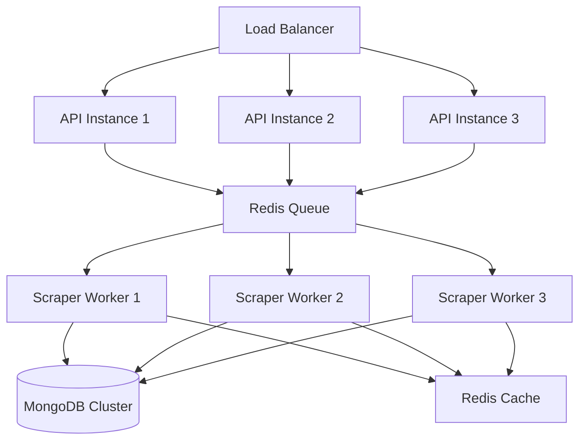

# Mejores Prácticas y Consideraciones - Twitter Scraper

## ⚠️ Advertencias Legales y Éticas

### 1. Términos de Servicio de Twitter
- **IMPORTANTE**: El scraping de Twitter puede violar sus Términos de Servicio
- Twitter ofrece una API oficial que debería ser la primera opción
- El scraping debe usarse solo para propósitos educativos o cuando la API no sea suficiente
- Riesgo de bloqueo de cuenta o IP

### 2. Rate Limiting y Respeto
- Implementar delays entre requests (mínimo 2-3 segundos)
- No hacer scraping masivo que pueda afectar el servicio
- Respetar robots.txt (aunque Twitter lo bloquea para scrapers)
- Considerar usar la API oficial de Twitter para producción

### 3. Privacidad de Datos
- No almacenar información sensible de usuarios
- Cumplir con GDPR/CCPA si aplica
- Implementar políticas de retención de datos
- Permitir eliminación de datos bajo solicitud

## 🔒 Seguridad

### 1. Gestión de Credenciales

```typescript
// ❌ NUNCA hacer esto
const username = 'myusername';
const password = 'mypassword123';

// ✅ Usar variables de entorno
const username = process.env.TWITTER_USERNAME;
const password = process.env.TWITTER_PASSWORD;

// ✅ Mejor aún: usar un servicio de secrets
import { SecretsManager } from '@aws-sdk/client-secrets-manager';
```

### 2. Encriptación de Sesiones

```typescript
// Encriptar datos de sesión antes de guardar
import * as crypto from 'crypto';

class SessionManager {
  private encryptionKey: string;

  encryptSession(data: any): string {
    const cipher = crypto.createCipher('aes-256-cbc', this.encryptionKey);
    let encrypted = cipher.update(JSON.stringify(data), 'utf8', 'hex');
    encrypted += cipher.final('hex');
    return encrypted;
  }

  decryptSession(encrypted: string): any {
    const decipher = crypto.createDecipher('aes-256-cbc', this.encryptionKey);
    let decrypted = decipher.update(encrypted, 'hex', 'utf8');
    decrypted += decipher.final('utf8');
    return JSON.parse(decrypted);
  }
}
```

### 3. Sanitización de Datos

```typescript
// Sanitizar datos antes de guardar en DB
import * as sanitizeHtml from 'sanitize-html';

function sanitizeTweetData(tweet: any) {
  return {
    ...tweet,
    text: sanitizeHtml(tweet.text, {
      allowedTags: [],
      allowedAttributes: {},
    }),
    author: {
      ...tweet.author,
      displayName: sanitizeHtml(tweet.author.displayName, {
        allowedTags: [],
        allowedAttributes: {},
      }),
    },
  };
}
```

## 🚀 Optimizaciones de Performance

### 1. Pool de Navegadores

```typescript
// Para scraping paralelo, usar pool de navegadores
@Injectable()
export class BrowserPoolService {
  private pool: Browser[] = [];
  private maxBrowsers = 3;

  async getBrowser(): Promise<Browser> {
    if (this.pool.length < this.maxBrowsers) {
      const browser = await chromium.launch();
      this.pool.push(browser);
      return browser;
    }
    // Retornar browser disponible o esperar
    return this.pool[0];
  }

  async releaseBrowser(browser: Browser): Promise<void> {
    // Lógica para liberar o cerrar browser
  }
}
```

### 2. Caché de Datos

```typescript
// Usar Redis para cachear perfiles y tweets recientes
import { Injectable } from '@nestjs/common';
import { Redis } from 'ioredis';

@Injectable()
export class CacheService {
  private redis: Redis;

  constructor() {
    this.redis = new Redis({
      host: process.env.REDIS_HOST,
      port: parseInt(process.env.REDIS_PORT),
    });
  }

  async cacheTweets(username: string, tweets: any[], ttl = 3600): Promise<void> {
    const key = `tweets:${username}`;
    await this.redis.setex(key, ttl, JSON.stringify(tweets));
  }

  async getCachedTweets(username: string): Promise<any[] | null> {
    const key = `tweets:${username}`;
    const cached = await this.redis.get(key);
    return cached ? JSON.parse(cached) : null;
  }
}
```

### 3. Queue para Scraping Asíncrono

```typescript
// Usar Bull para procesar scraping en background
import { InjectQueue } from '@nestjs/bull';
import { Queue } from 'bull';

@Injectable()
export class TwitterScraperService {
  constructor(
    @InjectQueue('twitter-scraping') private scrapingQueue: Queue,
  ) {}

  async queueUserScraping(username: string): Promise<string> {
    const job = await this.scrapingQueue.add('scrape-user', {
      username,
      timestamp: new Date(),
    });
    return job.id;
  }

  async getJobStatus(jobId: string): Promise<any> {
    const job = await this.scrapingQueue.getJob(jobId);
    return {
      id: job.id,
      progress: job.progress(),
      state: await job.getState(),
      result: job.returnvalue,
    };
  }
}

// Processor
@Processor('twitter-scraping')
export class TwitterScrapingProcessor {
  @Process('scrape-user')
  async handleUserScraping(job: Job) {
    const { username } = job.data;
    
    // Actualizar progreso
    await job.progress(10);
    
    // Realizar scraping
    const tweets = await this.scraperService.getTweetsByUsername(username);
    
    await job.progress(100);
    return tweets;
  }
}
```

## 🛡️ Manejo Robusto de Errores

### 1. Retry con Backoff Exponencial

```typescript
async function retryWithBackoff<T>(
  fn: () => Promise<T>,
  maxRetries = 3,
  baseDelay = 1000,
): Promise<T> {
  for (let i = 0; i < maxRetries; i++) {
    try {
      return await fn();
    } catch (error) {
      if (i === maxRetries - 1) throw error;
      
      const delay = baseDelay * Math.pow(2, i);
      console.log(`Retry ${i + 1}/${maxRetries} after ${delay}ms`);
      await new Promise(resolve => setTimeout(resolve, delay));
    }
  }
}

// Uso
const tweets = await retryWithBackoff(
  () => this.scraperService.getTweetsByUsername('elonmusk'),
  3,
  2000,
);
```

### 2. Circuit Breaker

```typescript
// Implementar circuit breaker para evitar sobrecarga
import * as CircuitBreaker from 'opossum';

const options = {
  timeout: 30000, // 30 segundos
  errorThresholdPercentage: 50,
  resetTimeout: 60000, // 1 minuto
};

const breaker = new CircuitBreaker(
  async (username: string) => {
    return await scraperService.getTweetsByUsername(username);
  },
  options,
);

breaker.on('open', () => {
  console.log('Circuit breaker opened - too many failures');
});

breaker.on('halfOpen', () => {
  console.log('Circuit breaker half-open - testing');
});

// Uso
const tweets = await breaker.fire('elonmusk');
```

### 3. Manejo de Rate Limiting de Twitter

```typescript
async detectAndHandleRateLimit(page: Page): Promise<void> {
  const rateLimitSelectors = [
    'text="Rate limit exceeded"',
    'text="Try again later"',
    '[data-testid="error-detail"]',
  ];

  for (const selector of rateLimitSelectors) {
    const element = await page.$(selector);
    if (element) {
      const text = await element.textContent();
      this.logger.warn(`Rate limit detected: ${text}`);
      
      // Extraer tiempo de espera si está disponible
      const waitTimeMatch = text.match(/(\d+)\s*(minute|hour)/i);
      const waitTime = waitTimeMatch 
        ? parseInt(waitTimeMatch[1]) * (waitTimeMatch[2] === 'hour' ? 3600000 : 60000)
        : 900000; // Default 15 minutos
      
      this.logger.log(`Waiting ${waitTime}ms before retrying`);
      await new Promise(resolve => setTimeout(resolve, waitTime));
      
      return;
    }
  }
}
```

## 📊 Monitoreo y Logging

### 1. Structured Logging

```typescript
import { Logger } from '@nestjs/common';
import * as winston from 'winston';

const logger = winston.createLogger({
  format: winston.format.combine(
    winston.format.timestamp(),
    winston.format.json(),
  ),
  transports: [
    new winston.transports.File({ filename: 'error.log', level: 'error' }),
    new winston.transports.File({ filename: 'scraping.log' }),
  ],
});

// Uso
logger.info('Scraping started', {
  username: 'elonmusk',
  limit: 50,
  timestamp: new Date().toISOString(),
});

logger.error('Scraping failed', {
  username: 'elonmusk',
  error: error.message,
  stack: error.stack,
});
```

### 2. Métricas con Prometheus

```typescript
import { Counter, Histogram, register } from 'prom-client';

const scrapingCounter = new Counter({
  name: 'twitter_scraping_total',
  help: 'Total number of scraping operations',
  labelNames: ['status', 'username'],
});

const scrapingDuration = new Histogram({
  name: 'twitter_scraping_duration_seconds',
  help: 'Duration of scraping operations',
  labelNames: ['username'],
});

// Uso
const end = scrapingDuration.startTimer({ username });
try {
  const tweets = await this.getTweetsByUsername(username);
  scrapingCounter.inc({ status: 'success', username });
  return tweets;
} catch (error) {
  scrapingCounter.inc({ status: 'error', username });
  throw error;
} finally {
  end();
}
```

### 3. Health Checks

```typescript
import { Controller, Get } from '@nestjs/common';
import { HealthCheck, HealthCheckService, MongooseHealthIndicator } from '@nestjs/terminus';

@Controller('health')
export class HealthController {
  constructor(
    private health: HealthCheckService,
    private db: MongooseHealthIndicator,
    private browserService: PlaywrightBrowserService,
  ) {}

  @Get()
  @HealthCheck()
  check() {
    return this.health.check([
      () => this.db.pingCheck('database'),
      () => this.checkBrowser(),
    ]);
  }

  private async checkBrowser() {
    const isActive = await this.browserService.isSessionActive();
    return {
      browser: {
        status: isActive ? 'up' : 'down',
      },
    };
  }
}
```

## 🧪 Testing Strategies

### 1. Mock de Playwright para Tests

```typescript
// test/mocks/playwright.mock.ts
export const mockPage = {
  goto: jest.fn(),
  waitForSelector: jest.fn(),
  fill: jest.fn(),
  click: jest.fn(),
  $$: jest.fn(),
  evaluate: jest.fn(),
  screenshot: jest.fn(),
};

export const mockBrowser = {
  newContext: jest.fn().mockResolvedValue({
    newPage: jest.fn().mockResolvedValue(mockPage),
    addCookies: jest.fn(),
    cookies: jest.fn(),
  }),
  close: jest.fn(),
};

// Uso en tests
describe('TwitterScraperService', () => {
  beforeEach(() => {
    jest.spyOn(chromium, 'launch').mockResolvedValue(mockBrowser as any);
  });

  it('should scrape tweets successfully', async () => {
    mockPage.$$.mockResolvedValue([
      { /* mock tweet element */ },
    ]);

    const tweets = await service.getTweetsByUsername('testuser');
    expect(tweets).toHaveLength(1);
  });
});
```

### 2. Tests de Integración con MongoDB Memory Server

```typescript
import { MongoMemoryServer } from 'mongodb-memory-server';
import { MongooseModule } from '@nestjs/mongoose';

describe('TweetRepository Integration', () => {
  let mongod: MongoMemoryServer;

  beforeAll(async () => {
    mongod = await MongoMemoryServer.create();
    const uri = mongod.getUri();

    const module = await Test.createTestingModule({
      imports: [
        MongooseModule.forRoot(uri),
        MongooseModule.forFeature([{ name: Tweet.name, schema: TweetSchema }]),
      ],
      providers: [TweetRepository],
    }).compile();

    repository = module.get<TweetRepository>(TweetRepository);
  });

  afterAll(async () => {
    await mongod.stop();
  });

  it('should save and retrieve tweets', async () => {
    const tweet = await repository.create({ /* tweet data */ });
    const found = await repository.findById(tweet.tweetId);
    expect(found).toBeDefined();
  });
});
```

## 🔄 Mantenimiento y Actualizaciones

### 1. Selectores Dinámicos

Twitter cambia frecuentemente sus selectores. Implementar un sistema flexible:

```typescript
// Múltiples selectores fallback
const TWEET_TEXT_SELECTORS = [
  '[data-testid="tweetText"]',
  '.tweet-text',
  'div[lang]',
  // Más fallbacks
];

async function findElement(page: Page, selectors: string[]): Promise<ElementHandle | null> {
  for (const selector of selectors) {
    try {
      const element = await page.$(selector);
      if (element) return element;
    } catch (error) {
      continue;
    }
  }
  return null;
}
```

### 2. Versionado de Selectores

```typescript
// Mantener versiones de selectores
const SELECTOR_VERSIONS = {
  'v1': { /* selectores antiguos */ },
  'v2': { /* selectores actuales */ },
};

// Detectar versión automáticamente
async function detectTwitterVersion(page: Page): Promise<string> {
  // Lógica para detectar qué versión de Twitter se está usando
  const hasNewLayout = await page.$('[data-testid="primaryColumn"]');
  return hasNewLayout ? 'v2' : 'v1';
}
```

### 3. Notificaciones de Cambios

```typescript
// Alertar cuando los selectores fallan
async function monitorSelectorHealth(): Promise<void> {
  const failedSelectors = [];
  
  for (const [name, selector] of Object.entries(TWITTER_SELECTORS.TWEET)) {
    try {
      await page.waitForSelector(selector, { timeout: 5000 });
    } catch (error) {
      failedSelectors.push(name);
    }
  }

  if (failedSelectors.length > 0) {
    // Enviar alerta (email, Slack, etc.)
    await notificationService.alert({
      type: 'SELECTOR_FAILURE',
      selectors: failedSelectors,
      timestamp: new Date(),
    });
  }
}
```

## 📈 Escalabilidad

### 1. Arquitectura Distribuida



### 2. Sharding de MongoDB

```typescript
// Configurar sharding por username
db.adminCommand({
  shardCollection: "twitter-scraper.tweets",
  key: { "author.username": "hashed" }
});

// Índices para queries eficientes
db.tweets.createIndex({ "author.username": 1, "createdAt": -1 });
db.tweets.createIndex({ "hashtags": 1, "createdAt": -1 });
db.tweets.createIndex({ "tweetId": 1 }, { unique: true });
```

### 3. Proxy Rotation

```typescript
// Rotar proxies para evitar bloqueos
const PROXY_LIST = [
  'http://proxy1.example.com:8080',
  'http://proxy2.example.com:8080',
  'http://proxy3.example.com:8080',
];

let currentProxyIndex = 0;

async function launchBrowserWithProxy(): Promise<Browser> {
  const proxy = PROXY_LIST[currentProxyIndex];
  currentProxyIndex = (currentProxyIndex + 1) % PROXY_LIST.length;

  return await chromium.launch({
    proxy: {
      server: proxy,
    },
  });
}
```

## 🎯 Mejores Prácticas Generales

1. **Siempre usar User-Agent realista**
2. **Implementar delays aleatorios entre acciones**
3. **Rotar IPs si es posible**
4. **Guardar screenshots en caso de errores**
5. **Implementar logging detallado**
6. **Usar TypeScript para type safety**
7. **Validar todos los datos extraídos**
8. **Implementar rate limiting en la API**
9. **Documentar todos los endpoints**
10. **Mantener el código modular y testeable**

## 📚 Recursos Adicionales

- [Playwright Documentation](https://playwright.dev/)
- [NestJS Documentation](https://docs.nestjs.com/)
- [Mongoose Documentation](https://mongoosejs.com/)
- [Twitter API Official](https://developer.twitter.com/en/docs)
- [Web Scraping Best Practices](https://www.scrapingbee.com/blog/web-scraping-best-practices/)
