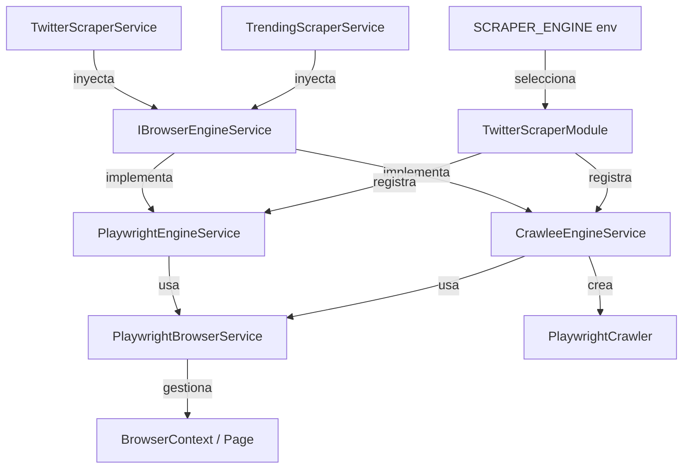

# Crawlee Abstraction Service Plan

## Objetivo

Crear un servicio de abstracción (`IBrowserEngineService`) que permita usar **Crawlee** o **Playwright puro** de forma intercambiable en `TrendingScraperService` y `TwitterScraperService`, sin cambiar la lógica de negocio de esos servicios.

---

## Problema Actual

### Arquitectura actual

```
PlaywrightBrowserService
  ├── initBrowser()          → lanza contexto persistente (sesión autenticada)
  ├── getPage()              → devuelve la Page del contexto persistente
  ├── createCrawler()        → crea un PlaywrightCrawler de Crawlee (instancia aislada)
  ├── isSessionActive()
  ├── takeScreenshot()
  └── closeBrowser()

TwitterScraperService
  ├── runWithPage()          → usa getPage() del contexto persistente
  └── runCrawlee()           → usa createCrawler() de Crawlee

TrendingScraperService
  └── usa getPage() directamente
```

### Problemas identificados

1. `PlaywrightBrowserService` tiene **dos responsabilidades**: gestión del ciclo de vida del browser Y la lógica de Crawlee.
2. `TwitterScraperService` tiene dos rutas de ejecución (`runWithPage` vs `runCrawlee`) que no son intercambiables.
3. `TrendingScraperService` está acoplado directamente a `PlaywrightBrowserService.getPage()`.
4. No hay forma de cambiar el motor de scraping sin modificar el código.

---

## Solución Propuesta

### Nueva arquitectura

```
IBrowserEngineService (interface)
  ├── navigate(url, collector)   → navega y ejecuta un callback con la Page
  ├── getPage()                  → devuelve la Page activa
  ├── isSessionActive()
  ├── takeScreenshot(name)
  └── ensureAuthenticated()

PlaywrightEngineService implements IBrowserEngineService
  └── usa el contexto persistente de PlaywrightBrowserService

CrawleeEngineService implements IBrowserEngineService
  └── usa PlaywrightCrawler de Crawlee para cada navegación

PlaywrightBrowserService (refactorizado)
  └── solo gestiona el ciclo de vida del browser (init, close, session)

TwitterScraperService
  └── inyecta IBrowserEngineService (sin saber si es Crawlee o Playwright)

TrendingScraperService
  └── inyecta IBrowserEngineService (sin saber si es Crawlee o Playwright)
```

---

## Diagrama de Flujo



---

## Archivos a Crear / Modificar

### Nuevos archivos

| Archivo | Descripción |
|---------|-------------|
| `src/modules/twitter/scraper/interfaces/browser-engine.interface.ts` | Define `IBrowserEngineService` |
| `src/modules/twitter/scraper/services/playwright-engine.service.ts` | Implementación con Playwright puro |
| `src/modules/twitter/scraper/services/crawlee-engine.service.ts` | Implementación con Crawlee |

### Archivos modificados

| Archivo | Cambio |
|---------|--------|
| `playwright-browser.service.ts` | Eliminar `createCrawler()`, mantener solo lifecycle |
| `twitter-scraper.service.ts` | Reemplazar `runWithPage()` y `runCrawlee()` con `IBrowserEngineService.navigate()` |
| `trending-scraper.service.ts` | Reemplazar `browserService.getPage()` con `IBrowserEngineService.getPage()` |
| `twitter-scraper.module.ts` | Registrar el provider correcto según `SCRAPER_ENGINE` |
| `env.validation.ts` | Agregar `SCRAPER_ENGINE: 'crawlee' | 'playwright'` |
| `.env.example` | Agregar `SCRAPER_ENGINE=crawlee` |

---

## Detalle de la Interface

```typescript
// src/modules/twitter/scraper/interfaces/browser-engine.interface.ts

export const BROWSER_ENGINE_SERVICE = 'BROWSER_ENGINE_SERVICE';

export interface IBrowserEngineService {
  /**
   * Navega a una URL y ejecuta el callback con la Page resultante.
   * La implementación decide si usa Crawlee o Playwright puro.
   */
  navigate<T>(url: string, collector: (page: Page) => Promise<T>): Promise<T>;

  /**
   * Devuelve la Page activa (para uso directo en casos que lo requieran).
   */
  getPage(): Page;

  /**
   * Verifica si la sesión de Twitter está activa.
   */
  isSessionActive(): Promise<boolean>;

  /**
   * Toma un screenshot de la página actual.
   */
  takeScreenshot(name: string): Promise<string>;

  /**
   * Asegura que el usuario esté autenticado, haciendo login si es necesario.
   */
  ensureAuthenticated(): Promise<void>;
}
```

---

## Detalle de PlaywrightEngineService

```typescript
// src/modules/twitter/scraper/services/playwright-engine.service.ts

@Injectable()
export class PlaywrightEngineService implements IBrowserEngineService {
  constructor(
    private readonly browserService: PlaywrightBrowserService,
    private readonly configService: ConfigService,
  ) {}

  async navigate<T>(url: string, collector: (page: Page) => Promise<T>): Promise<T> {
    const page = this.browserService.getPage();
    await page.goto(url, { waitUntil: 'domcontentloaded' });
    return collector(page);
  }

  getPage(): Page {
    return this.browserService.getPage();
  }

  isSessionActive(): Promise<boolean> {
    return this.browserService.isSessionActive();
  }

  takeScreenshot(name: string): Promise<string> {
    return this.browserService.takeScreenshot(name);
  }

  async ensureAuthenticated(): Promise<void> {
    // delega a TwitterScraperService o implementa aquí
  }
}
```

---

## Detalle de CrawleeEngineService

```typescript
// src/modules/twitter/scraper/services/crawlee-engine.service.ts

@Injectable()
export class CrawleeEngineService implements IBrowserEngineService {
  private playwrightCrawler: PlaywrightCrawler | null = null;

  constructor(
    private readonly browserService: PlaywrightBrowserService,
    private readonly configService: ConfigService,
  ) {}

  async navigate<T>(url: string, collector: (page: Page) => Promise<T>): Promise<T> {
    let result: T;
    let crawlError: Error | undefined;

    if (!this.playwrightCrawler) {
      this.playwrightCrawler = await this.browserService.createCrawler(
        async ({ page }) => {
          try {
            result = await collector(page);
          } catch (err) {
            crawlError = err;
          }
        },
      );
    }

    await this.playwrightCrawler.run([url]);
    if (crawlError) throw crawlError;
    return result!;
  }

  getPage(): Page {
    return this.browserService.getPage();
  }

  isSessionActive(): Promise<boolean> {
    return this.browserService.isSessionActive();
  }

  takeScreenshot(name: string): Promise<string> {
    return this.browserService.takeScreenshot(name);
  }

  async ensureAuthenticated(): Promise<void> {
    // delega a PlaywrightBrowserService
  }
}
```

---

## Registro en el Módulo

```typescript
// twitter-scraper.module.ts

const browserEngineProvider = {
  provide: BROWSER_ENGINE_SERVICE,
  useFactory: (
    browserService: PlaywrightBrowserService,
    configService: ConfigService,
  ) => {
    const engine = configService.get<string>('SCRAPER_ENGINE', 'crawlee');
    if (engine === 'playwright') {
      return new PlaywrightEngineService(browserService, configService);
    }
    return new CrawleeEngineService(browserService, configService);
  },
  inject: [PlaywrightBrowserService, ConfigService],
};
```

---

## Variable de Entorno

```bash
# .env.example
# Motor de scraping: 'crawlee' (con fingerprints/proxy) o 'playwright' (contexto persistente)
SCRAPER_ENGINE=crawlee
```

---

## Consideraciones Importantes

### Sobre ensureAuthenticated()
El método `ensureAuthenticated()` actualmente vive en `TwitterScraperService` y llama a `login()`. Hay dos opciones:
1. **Moverlo a `IBrowserEngineService`**: requiere que el engine service conozca las credenciales y la lógica de login.
2. **Mantenerlo en `TwitterScraperService`** y que `IBrowserEngineService` solo exponga `isSessionActive()`: más limpio, el engine no necesita saber de Twitter.

**Recomendación**: Opción 2. `ensureAuthenticated()` permanece en `TwitterScraperService` y `TrendingScraperService` lo llama a través de `scraperService.ensureAuthenticated()` (como ya lo hace hoy).

### Sobre el crawler de Crawlee
`CrawleeEngineService` necesita acceso a `createCrawler()` de `PlaywrightBrowserService`. Por lo tanto, `createCrawler()` **permanece** en `PlaywrightBrowserService` (no se elimina), pero se encapsula su uso dentro de `CrawleeEngineService`.

### Sobre el token de inyección
Se usa un **injection token** (`BROWSER_ENGINE_SERVICE`) en lugar de una clase abstracta para evitar problemas con NestJS y la inyección de dependencias con interfaces TypeScript.

---

## Pasos de Implementación

1. Crear `src/modules/twitter/scraper/interfaces/browser-engine.interface.ts`
2. Crear `src/modules/twitter/scraper/services/playwright-engine.service.ts`
3. Crear `src/modules/twitter/scraper/services/crawlee-engine.service.ts`
4. Actualizar `twitter-scraper.service.ts`:
   - Inyectar `@Inject(BROWSER_ENGINE_SERVICE) private engineService: IBrowserEngineService`
   - Reemplazar `runWithPage()` → `this.engineService.navigate()`
   - Reemplazar `runCrawlee()` → `this.engineService.navigate()`
   - Eliminar `private playwrightCrawler` y `runCrawlee()`/`runWithPage()`
5. Actualizar `trending-scraper.service.ts`:
   - Inyectar `@Inject(BROWSER_ENGINE_SERVICE) private engineService: IBrowserEngineService`
   - Reemplazar `this.browserService.getPage()` → `this.engineService.getPage()`
   - Reemplazar `this.browserService.takeScreenshot()` → `this.engineService.takeScreenshot()`
6. Actualizar `twitter-scraper.module.ts` con el factory provider
7. Actualizar `env.validation.ts` con `SCRAPER_ENGINE`
8. Actualizar `.env.example`
