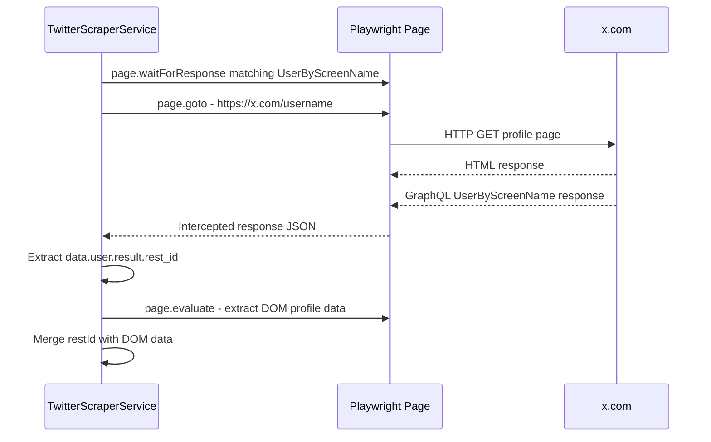

# Plan: Intercept UserByScreenName API Response to Extract rest_id

## Context

When navigating to a Twitter/X profile page (`https://x.com/{username}`), the frontend makes an internal GraphQL API call to an endpoint matching `UserByScreenName`. The response contains the user's numeric `rest_id` at `data.user.result.rest_id`.

Currently, [`getUserProfile()`](src/modules/twitter-scraper/services/twitter-scraper.service.ts:327) scrapes profile data from the DOM but does not capture this internal API response. We need to intercept it to obtain the user's numeric ID.

## Implementation Plan

### 1. Add `restId` field to XUser schema

**File:** [`x-user.schema.ts`](src/modules/twitter-scraper/schemas/x-user.schema.ts)

Add a new optional `restId` property of type `string` to the `XUser` class:

```typescript
@Prop({ index: true })
restId: string;
```

This stores the Twitter-internal numeric user ID. It's a `string` because Twitter IDs can exceed JavaScript's safe integer range.

### 2. Modify `getUserProfile()` to intercept the `UserByScreenName` response

**File:** [`twitter-scraper.service.ts`](src/modules/twitter-scraper/services/twitter-scraper.service.ts:327)

The current flow uses [`runWithPage()`](src/modules/twitter-scraper/services/twitter-scraper.service.ts:89) which navigates to the URL first, then runs the collector. The problem is that the `UserByScreenName` response fires **during** navigation, so we need to set up the listener **before** `page.goto()`.

**Approach:** Instead of using `runWithPage()` for the initial profile page load, we will directly use the page to:

1. Set up a `page.waitForResponse()` promise that matches the `UserByScreenName` endpoint **before** calling `page.goto()`
2. Navigate to the profile URL
3. Await the intercepted response and parse the JSON to extract `data.user.result.rest_id`



**Key code change in `getUserProfile()`:**

```typescript
async getUserProfile(username: string): Promise<any> {
  this.logger.log(`Getting profile for @${username}`);
  await this.ensureAuthenticated();

  try {
    const page = this.browserService.getPage();

    // Set up response interception BEFORE navigation
    const userByScreenNamePromise = page.waitForResponse(
      (response) =>
        response.url().includes('UserByScreenName') &&
        response.status() === 200,
      { timeout: 15000 },
    );

    // Navigate to profile page
    await page.goto(`https://x.com/${username}`, {
      waitUntil: 'domcontentloaded',
    });

    // Wait for the UserByScreenName response
    let restId = '';
    try {
      const apiResponse = await userByScreenNamePromise;
      const json = await apiResponse.json();
      restId = json?.data?.user?.result?.rest_id || '';
      this.logger.log(`Extracted rest_id for @${username}: ${restId}`);
    } catch (e) {
      this.logger.warn(`Failed to intercept UserByScreenName response for @${username}`, e);
    }

    // Wait for profile DOM to load
    await page.locator(TWITTER_SELECTORS.PROFILE.USERNAME).waitFor();

    // ... rest of existing DOM extraction logic ...

    return {
      ...basicData,
      restId,
      profileImageUrl,
      headerImageUrl,
      accountInfo,
    };
  } catch (error) {
    // ... existing error handling ...
  }
}
```

### 3. Include `restId` in the database upsert

The existing call to [`this.xUserRepository.upsert(profileData)`](src/modules/twitter-scraper/services/twitter-scraper.service.ts:497) will automatically include `restId` since it's spread into `profileData`. No additional changes needed in the repository — the `upsert` method already accepts `Partial<XUser>`.

## Files to Modify

| File | Change |
|------|--------|
| [`x-user.schema.ts`](src/modules/twitter-scraper/schemas/x-user.schema.ts) | Add `restId: string` property |
| [`twitter-scraper.service.ts`](src/modules/twitter-scraper/services/twitter-scraper.service.ts) | Refactor `getUserProfile()` to intercept `UserByScreenName` API response before navigation |

## Risks & Considerations

- **Endpoint URL pattern:** The `UserByScreenName` string is part of Twitter's internal GraphQL endpoint URL. If Twitter changes this, the interception will fail silently — the `restId` will just be empty, and the rest of the profile data will still work.
- **Race condition:** Using `page.waitForResponse()` set up before `page.goto()` ensures we don't miss the response. Playwright queues response matching from the moment `waitForResponse()` is called.
- **Timeout:** A 15-second timeout is used for the response interception. If it times out, we log a warning and continue without the `restId`.
- **No breaking changes:** The `restId` field is optional in the schema, so existing documents without it will continue to work.
