# Guía de Inicio Rápido - Twitter Scraper

## 🚀 Instalación y Configuración

### Paso 1: Instalar Dependencias

```bash
# Dependencias principales
yarn add @nestjs/mongoose mongoose playwright

# Dependencias de validación
yarn add class-validator class-transformer

# Dependencias opcionales (recomendadas)
yarn add @nestjs/throttler  # Rate limiting
yarn add @nestjs/bull bull  # Queue system
yarn add ioredis  # Cache
yarn add @nestjs/terminus  # Health checks

# Instalar navegadores de Playwright
npx playwright install chromium
```

### Paso 2: Configurar Variables de Entorno

Actualizar [`.env`](.env):

```env
# Application
NODE_ENV=development
PORT=3000

# Twitter Credentials
TWITTER_USERNAME=tu_usuario_de_twitter
TWITTER_PASSWORD=tu_contraseña
TWITTER_EMAIL=tu_email@example.com

# MongoDB
MONGODB_URI=mongodb://localhost:27017/twitter-scraper
MONGODB_DB_NAME=twitter-scraper

# Playwright Configuration
PLAYWRIGHT_HEADLESS=false  # true para producción
PLAYWRIGHT_TIMEOUT=30000
PLAYWRIGHT_SLOW_MO=100
PLAYWRIGHT_SESSION_PATH=./sessions/twitter-session.json

# Scraping Configuration
SCRAPING_MAX_TWEETS_PER_REQUEST=100
SCRAPING_SCROLL_DELAY=2000
SCRAPING_RETRY_ATTEMPTS=3
SCRAPING_RATE_LIMIT_DELAY=60000
```

### Paso 3: Iniciar MongoDB

```bash
# Opción 1: MongoDB local
mongod --dbpath /path/to/data

# Opción 2: Docker
docker run -d -p 27017:27017 --name mongodb mongo:latest

# Opción 3: MongoDB Atlas (cloud)
# Usar la URI de conexión proporcionada por Atlas
```

### Paso 4: Actualizar Validación de Variables de Entorno

Editar [`src/common/config/env.validation.ts`](src/common/config/env.validation.ts):

```typescript
import * as Joi from 'joi';

export const validationSchema = Joi.object({
  NODE_ENV: Joi.string()
    .valid('development', 'production', 'test')
    .default('development'),
  PORT: Joi.number().default(3000),
  
  // Twitter
  TWITTER_USERNAME: Joi.string().required(),
  TWITTER_PASSWORD: Joi.string().required(),
  TWITTER_EMAIL: Joi.string().email().optional(),
  
  // MongoDB
  MONGODB_URI: Joi.string().required(),
  MONGODB_DB_NAME: Joi.string().default('twitter-scraper'),
  
  // Playwright
  PLAYWRIGHT_HEADLESS: Joi.boolean().default(true),
  PLAYWRIGHT_TIMEOUT: Joi.number().default(30000),
  PLAYWRIGHT_SLOW_MO: Joi.number().default(100),
  PLAYWRIGHT_SESSION_PATH: Joi.string().default('./sessions/twitter-session.json'),
  
  // Scraping
  SCRAPING_MAX_TWEETS_PER_REQUEST: Joi.number().default(100),
  SCRAPING_SCROLL_DELAY: Joi.number().default(2000),
  SCRAPING_RETRY_ATTEMPTS: Joi.number().default(3),
  SCRAPING_RATE_LIMIT_DELAY: Joi.number().default(60000),
});
```

## 📁 Estructura de Archivos a Crear

```
src/modules/twitter-scraper/
├── twitter-scraper.module.ts
├── controllers/
│   └── twitter-scraper.controller.ts
├── services/
│   ├── twitter-scraper.service.ts
│   └── playwright-browser.service.ts
├── repositories/
│   └── tweet.repository.ts
├── schemas/
│   └── tweet.schema.ts
├── dto/
│   ├── get-tweets-by-username.dto.ts
│   ├── search-tweets.dto.ts
│   ├── login.dto.ts
│   └── tweet-response.dto.ts
├── interfaces/
│   ├── tweet.interface.ts
│   └── scraper-options.interface.ts
└── constants/
    └── twitter-selectors.constants.ts
```

## 🔨 Orden de Implementación

### 1. Crear Constantes de Selectores

Crear [`src/modules/twitter-scraper/constants/twitter-selectors.constants.ts`](src/modules/twitter-scraper/constants/twitter-selectors.constants.ts)

Ver código completo en [`plans/implementation-examples.md`](plans/implementation-examples.md#8-twitter-selectors-constants)

### 2. Crear Schema de Tweet

Crear [`src/modules/twitter-scraper/schemas/tweet.schema.ts`](src/modules/twitter-scraper/schemas/tweet.schema.ts)

Ver código completo en [`plans/implementation-examples.md`](plans/implementation-examples.md#1-tweet-schema-mongoose)

### 3. Crear DTOs

Crear los siguientes archivos en [`src/modules/twitter-scraper/dto/`](src/modules/twitter-scraper/dto/):
- `get-tweets-by-username.dto.ts`
- `search-tweets.dto.ts`
- `login.dto.ts`

Ver código completo en [`plans/implementation-examples.md`](plans/implementation-examples.md#6-dtos)

### 4. Crear PlaywrightBrowserService

Crear [`src/modules/twitter-scraper/services/playwright-browser.service.ts`](src/modules/twitter-scraper/services/playwright-browser.service.ts)

Ver código completo en [`plans/implementation-examples.md`](plans/implementation-examples.md#2-playwrightbrowserservice)

### 5. Crear TweetRepository

Crear [`src/modules/twitter-scraper/repositories/tweet.repository.ts`](src/modules/twitter-scraper/repositories/tweet.repository.ts)

Ver código completo en [`plans/implementation-examples.md`](plans/implementation-examples.md#7-tweetrepository)

### 6. Crear TwitterScraperService

Crear [`src/modules/twitter-scraper/services/twitter-scraper.service.ts`](src/modules/twitter-scraper/services/twitter-scraper.service.ts)

Ver código completo en [`plans/implementation-examples.md`](plans/implementation-examples.md#3-twitterscraperservice---login)

### 7. Crear TwitterScraperController

Crear [`src/modules/twitter-scraper/controllers/twitter-scraper.controller.ts`](src/modules/twitter-scraper/controllers/twitter-scraper.controller.ts)

Ver código completo en [`plans/implementation-examples.md`](plans/implementation-examples.md#5-twitterscrapercontroller)

### 8. Crear TwitterScraperModule

Crear [`src/modules/twitter-scraper/twitter-scraper.module.ts`](src/modules/twitter-scraper/twitter-scraper.module.ts)

Ver código completo en [`plans/implementation-examples.md`](plans/implementation-examples.md#9-module-configuration)

### 9. Actualizar AppModule

Editar [`src/app.module.ts`](src/app.module.ts)

Ver código completo en [`plans/implementation-examples.md`](plans/implementation-examples.md#10-app-module-update)

## 🧪 Probar la Implementación

### 1. Iniciar el Servidor

```bash
yarn start:dev
```

### 2. Probar Login

```bash
curl -X POST http://localhost:3000/api/twitter/login \
  -H "Content-Type: application/json" \
  -d '{
    "username": "tu_usuario",
    "password": "tu_contraseña"
  }'
```

Respuesta esperada:
```json
{
  "success": true,
  "message": "Login successful"
}
```

### 3. Scrapear Tweets de un Usuario

```bash
curl "http://localhost:3000/api/twitter/tweets/username/elonmusk?limit=10"
```

Respuesta esperada:
```json
{
  "username": "elonmusk",
  "count": 10,
  "tweets": [
    {
      "tweetId": "1234567890",
      "text": "Tweet text here...",
      "author": {
        "username": "elonmusk",
        "displayName": "Elon Musk",
        "verified": true
      },
      "createdAt": "2024-01-01T12:00:00.000Z",
      "metrics": {
        "likes": 1000,
        "retweets": 500,
        "replies": 100
      }
    }
  ]
}
```

### 4. Buscar Tweets

```bash
curl -X POST http://localhost:3000/api/twitter/tweets/search \
  -H "Content-Type: application/json" \
  -d '{
    "searchTerm": "artificial intelligence",
    "limit": 20
  }'
```

### 5. Ver Tweets Almacenados

```bash
curl "http://localhost:3000/api/twitter/stored/tweets?page=1&limit=20"
```

### 6. Ver Estadísticas

```bash
curl "http://localhost:3000/api/twitter/stored/stats"
```

## 🐛 Troubleshooting

### Problema: "Browser not initialized"

**Solución**: Asegurarse de llamar al login primero o que el servicio inicialice el navegador automáticamente.

```typescript
// En TwitterScraperService, agregar en onModuleInit
async onModuleInit() {
  await this.browserService.initBrowser();
}
```

### Problema: "Login failed"

**Causas posibles**:
1. Credenciales incorrectas
2. Twitter detectó actividad sospechosa
3. Selectores de login cambiaron
4. Requiere verificación 2FA

**Solución**: 
- Verificar credenciales en `.env`
- Ejecutar con `PLAYWRIGHT_HEADLESS=false` para ver qué sucede
- Actualizar selectores si es necesario
- Implementar manejo de 2FA

### Problema: "No tweets found"

**Causas posibles**:
1. Selectores de tweets cambiaron
2. Usuario no tiene tweets públicos
3. Rate limiting de Twitter

**Solución**:
- Verificar selectores en [`twitter-selectors.constants.ts`](src/modules/twitter-scraper/constants/twitter-selectors.constants.ts)
- Tomar screenshot para debugging: `await this.browserService.takeScreenshot('debug')`
- Aumentar timeouts en configuración

### Problema: "MongoDB connection failed"

**Solución**:
```bash
# Verificar que MongoDB esté corriendo
mongosh

# O con Docker
docker ps | grep mongo

# Verificar URI en .env
echo $MONGODB_URI
```

## 📊 Monitoreo en Desarrollo

### Ver Logs en Tiempo Real

```bash
# Terminal 1: Servidor
yarn start:dev

# Terminal 2: Logs de MongoDB
tail -f /var/log/mongodb/mongod.log

# Terminal 3: Logs de la aplicación
tail -f logs/scraping.log
```

### Inspeccionar Base de Datos

```bash
mongosh twitter-scraper

# Ver colecciones
show collections

# Ver tweets
db.tweets.find().limit(5).pretty()

# Contar tweets por usuario
db.tweets.aggregate([
  { $group: { _id: "$author.username", count: { $sum: 1 } } },
  { $sort: { count: -1 } },
  { $limit: 10 }
])

# Ver estadísticas
db.tweets.stats()
```

## 🔄 Flujo de Trabajo Típico

```mermaid
sequenceDiagram
    participant Dev as Developer
    participant API as API Server
    participant Browser as Playwright
    participant Twitter as X.com
    participant DB as MongoDB

    Dev->>API: POST /api/twitter/login
    API->>Browser: Inicializar navegador
    Browser->>Twitter: Login con credenciales
    Twitter-->>Browser: Sesión activa
    Browser->>API: Guardar sesión
    API-->>Dev: Login exitoso

    Dev->>API: GET /tweets/username/elonmusk
    API->>Browser: Navegar a perfil
    Browser->>Twitter: Cargar perfil
    Twitter-->>Browser: HTML del perfil
    Browser->>API: Extraer tweets
    API->>DB: Guardar tweets
    DB-->>API: Confirmación
    API-->>Dev: JSON con tweets

    Dev->>API: GET /stored/stats
    API->>DB: Query estadísticas
    DB-->>API: Datos agregados
    API-->>Dev: JSON con stats
```



## 📝 Próximos Pasos

1. ✅ Implementar estructura básica
2. ✅ Probar login y scraping básico
3. 🔄 Implementar método `getTweetsFromSearchTerm`
4. 🔄 Implementar método `getUserProfile`
5. 🔄 Agregar manejo de errores robusto
6. 🔄 Implementar tests
7. 🔄 Agregar documentación Swagger
8. 🔄 Optimizar performance con caché
9. 🔄 Implementar queue system para scraping asíncrono
10. 🔄 Deploy a producción

## 🎓 Recursos de Aprendizaje

- **Playwright**: https://playwright.dev/docs/intro
- **NestJS**: https://docs.nestjs.com/
- **Mongoose**: https://mongoosejs.com/docs/guide.html
- **Web Scraping Ethics**: https://www.scrapingbee.com/blog/web-scraping-laws/

## ⚠️ Recordatorios Importantes

1. **Nunca commitear credenciales** - Usar `.env` y agregarlo a `.gitignore`
2. **Respetar rate limits** - No hacer scraping agresivo
3. **Manejar errores gracefully** - Twitter puede cambiar en cualquier momento
4. **Guardar screenshots** - Útil para debugging
5. **Monitorear selectores** - Pueden cambiar sin aviso
6. **Usar la API oficial** - Cuando sea posible, preferir la API de Twitter
7. **Cumplir con ToS** - Leer y entender los términos de servicio

## 🆘 Soporte

Si encuentras problemas:

1. Revisar logs en `./logs/`
2. Ver screenshots en `./screenshots/`
3. Consultar [`plans/best-practices-and-considerations.md`](plans/best-practices-and-considerations.md)
4. Verificar que los selectores estén actualizados
5. Probar con `PLAYWRIGHT_HEADLESS=false` para ver el navegador

---

**¡Listo para comenzar!** 🚀

Ejecuta los comandos de instalación y sigue los pasos en orden. Si tienes dudas, consulta los documentos de arquitectura y ejemplos de implementación en el directorio [`plans/`](plans/).
