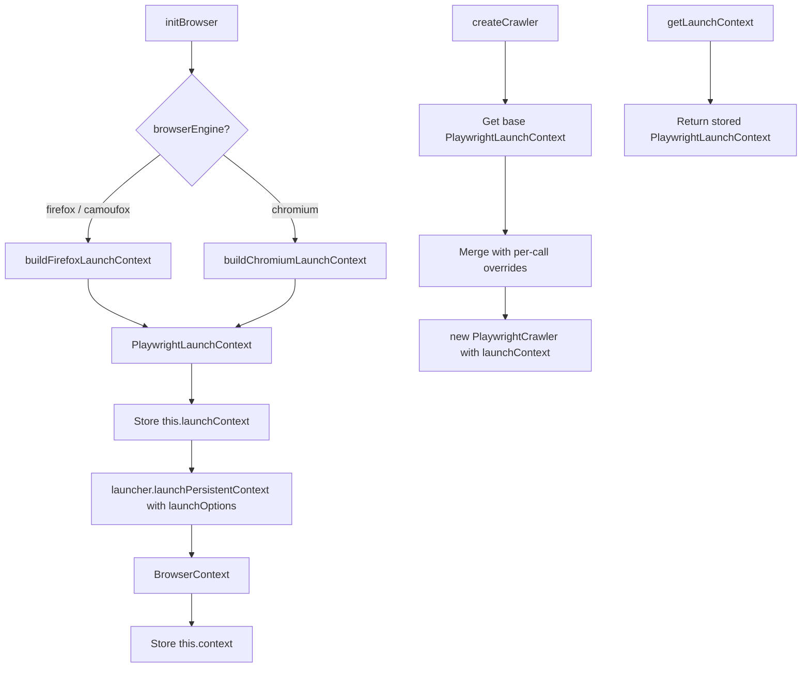

# Refactor: launchChromium & launchFirefox → PlaywrightLaunchContext

## Problem

Currently [`launchFirefox()`](src/modules/twitter-scraper/services/playwright-browser.service.ts:116) and [`launchChromium()`](src/modules/twitter-scraper/services/playwright-browser.service.ts:176) call Playwright's `launchPersistentContext()` directly and return a live `BrowserContext`. This tightly couples browser launch logic with configuration, making it impossible to reuse the launch configuration in [`createCrawler()`](src/modules/twitter-scraper/services/playwright-browser.service.ts:229) — which currently duplicates much of the same config inline.

Additionally, [`runCrawlee()`](src/modules/twitter-scraper/services/twitter-scraper.service.ts:88) passes `launcher: this.browserContext` which is a type error — `launcher` expects a `BrowserType`, not a `BrowserContext`.

## Goal

Refactor `launchFirefox` and `launchChromium` to return a `PlaywrightLaunchContext` configuration object. The actual browser launch moves to `initBrowser()`, and `createCrawler()` can reuse the same config.

## PlaywrightLaunchContext Shape

From `@crawlee/playwright`:

```typescript
interface PlaywrightLaunchContext {
  launchOptions?: LaunchOptions & PersistentContextOptions;
  proxyUrl?: string;
  useChrome?: boolean;
  useIncognitoPages?: boolean;
  experimentalContainers?: boolean;
  userDataDir?: string;
  launcher?: BrowserType;  // e.g. firefox, chromium
}
```

## Changes

### 1. `launchFirefox()` — return config instead of launching

**Before:** calls `firefox.launchPersistentContext(...)` → returns `BrowserContext`

**After:** returns a `PlaywrightLaunchContext` object:

```typescript
private buildFirefoxLaunchContext(): PlaywrightLaunchContext {
  return {
    launcher: firefox,
    userDataDir: this.userDataDir,
    launchOptions: {
      headless,
      slowMo,
      viewport: null,
      locale: 'es-AR',
      // ... all firefoxUserPrefs ...
    },
  };
}
```

### 2. `launchChromium()` — return config instead of launching

**Before:** calls `chromium.launchPersistentContext(...)` → returns `BrowserContext`

**After:** returns a `PlaywrightLaunchContext` object:

```typescript
private buildChromiumLaunchContext(): PlaywrightLaunchContext {
  return {
    launcher: chromium,
    userDataDir: this.userDataDir,
    useChrome: true,
    launchOptions: {
      headless,
      slowMo,
      args: [...],
      ignoreDefaultArgs: ['--enable-automation'],
      viewport: null,
      locale: 'en-US',
      // ...
    },
  };
}
```

### 3. `initBrowser()` — use the config to launch

`initBrowser()` will:
1. Call `buildFirefoxLaunchContext()` or `buildChromiumLaunchContext()` to get the config
2. Store the `PlaywrightLaunchContext` as `this.launchContext`
3. Use the config to launch the persistent context via Playwright directly:

```typescript
const launchCtx = this.buildLaunchContext(headless, slowMo);
this.launchContext = launchCtx;

const launcher = launchCtx.launcher ?? firefox;
this.context = await launcher.launchPersistentContext(
  launchCtx.userDataDir ?? this.userDataDir,
  launchCtx.launchOptions ?? {},
);
```

### 4. `createCrawler()` — reuse the launch context

Instead of duplicating launch config, `createCrawler()` can merge the stored `PlaywrightLaunchContext` with per-call overrides:

```typescript
const baseLaunchContext = this.buildLaunchContext(headless, slowMo);

const crawlerConfig = {
  requestHandler,
  launchContext: {
    ...baseLaunchContext,
    ...(proxyUrl && { proxyUrl }),
    // Camoufox overrides if needed
  },
  // ...
};
```

### 5. Fix `runCrawlee()` in `twitter-scraper.service.ts`

Remove the incorrect `launchContext: { launcher: this.browserContext }` — `browserContext` is not a `BrowserType`. Either:
- Don't pass `launchContext` at all and let `createCrawler()` use its defaults, or
- Pass the stored `PlaywrightLaunchContext` from the browser service via a new getter

### 6. New getter: `getLaunchContext()`

Expose the stored `PlaywrightLaunchContext` so consumers like `twitter-scraper.service.ts` can access it:

```typescript
getLaunchContext(): PlaywrightLaunchContext | null {
  return this.launchContext;
}
```

## Files Modified

| File | Changes |
|------|---------|
| [`playwright-browser.service.ts`](src/modules/twitter-scraper/services/playwright-browser.service.ts) | Refactor `launchFirefox`/`launchChromium` → `buildFirefoxLaunchContext`/`buildChromiumLaunchContext`, update `initBrowser`, simplify `createCrawler`, add `getLaunchContext()`, import `PlaywrightLaunchContext` |
| [`twitter-scraper.service.ts`](src/modules/twitter-scraper/services/twitter-scraper.service.ts) | Fix `runCrawlee` to not pass invalid `launcher`, use `getLaunchContext()` if needed |

## Flow Diagram


