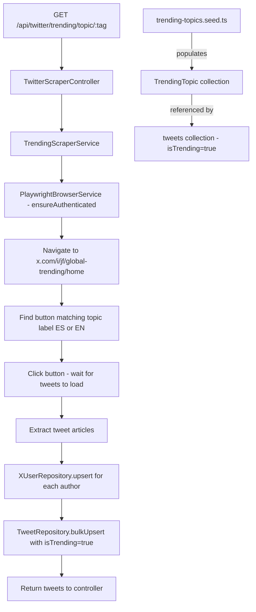
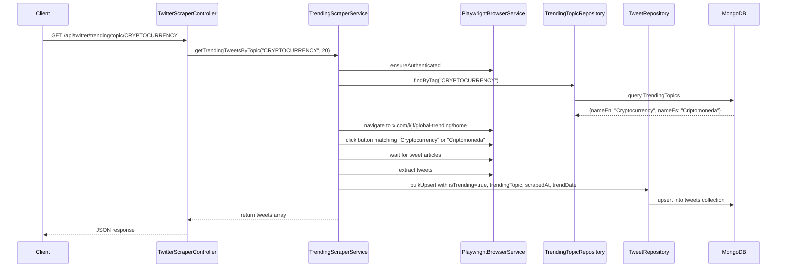

# Plan: Trending Tweets by Topic (Scraping)

## Overview

Since the X API does not expose trending tweets by topic, we scrape `https://x.com/i/jf/global-trending/home`, click the topic button (e.g. "Criptomoneda" / "Cryptocurrency"), wait for tweets to load, and extract them.

Trending tweets are stored in the **same `tweets` collection** as regular tweets, using additional fields on the `Tweet` schema to flag them as trending and link them to a `TrendingTopic`. A seed file populates the 24 topics in both Spanish and English.

> **Refactoring note (2026-02-20):** The original design used a separate `TrendingTweet` schema and `trendingtweets` collection. This was consolidated into the `Tweet` schema to avoid data duplication and simplify queries. The `TrendingTweet` schema and `TrendingTweetRepository` have been deleted.

---

## Architecture Diagram



---

## Schema: `Tweet` (extended with trending fields)

The `Tweet` schema in `src/modules/twitter-scraper/schemas/tweet.schema.ts` now includes:

```typescript
/** Whether this tweet was captured as part of a trending topic scrape. */
@Prop({ default: false, index: true })
isTrending: boolean;

/**
 * Reference to the TrendingTopic this tweet was associated with.
 * Only set when isTrending is true.
 */
@Prop({
  type: MongooseSchema.Types.ObjectId,
  ref: TrendingTopic.name,
  index: true,
})
trendingTopic: TrendingTopic;

/** Exact datetime when the scraping run that captured this tweet occurred. */
@Prop({ index: true })
scrapedAt: Date;

/**
 * Date-only field (stored as midnight UTC) representing the calendar day
 * on which the trending scrape was performed.
 * Useful for grouping/filtering trending tweets by day.
 */
@Prop({ index: true })
trendDate: Date;
```

Compound indexes added:
- `{ isTrending: 1, trendDate: -1 }`
- `{ trendingTopic: 1, trendDate: -1 }`
- `{ trendingTopic: 1, scrapedAt: -1 }`

---

## Schema: `TrendingTopic`

File: `src/modules/twitter-scraper/schemas/trending-topic.schema.ts`

```typescript
@Schema({ timestamps: true })
export class TrendingTopic {
  @Prop({ required: true, unique: true, index: true })
  tag: string;           // e.g. "CRYPTOCURRENCY"

  @Prop({ required: true })
  nameEn: string;        // e.g. "Cryptocurrency"

  @Prop({ required: true })
  nameEs: string;        // e.g. "Criptomoneda"
}
```

---

## Repositories

### `TrendingTopicRepository`

File: `src/modules/twitter-scraper/repositories/trending-topic.repository.ts`

Methods:
- `findAll(): Promise<TrendingTopic[]>`
- `findByTag(tag: string): Promise<TrendingTopic | null>`
- `upsert(data): Promise<TrendingTopic>`

### `TweetRepository` (trending methods)

File: `src/modules/twitter-scraper/repositories/tweet.repository.ts`

Trending-specific methods added:
- `findTrending(options): Promise<Tweet[]>` — all tweets where `isTrending: true`
- `findByTrendingTopic(topicId, options): Promise<Tweet[]>` — by ObjectId
- `findByTrendingTopicTag(tag, options): Promise<Tweet[]>` — by topic tag string (aggregation)
- `countByTrendingTopic(topicId): Promise<number>`

---

## Service: `TrendingScraperService`

File: `src/modules/twitter-scraper/services/trending-scraper.service.ts`

Core method:
```typescript
async getTrendingTweetsByTopic(tag: string, limit = 20): Promise<any[]>
```

Steps:
1. `ensureAuthenticated()`
2. Look up `TrendingTopic` by `tag` to get `nameEn` and `nameEs`
3. Navigate to `https://x.com/i/jf/global-trending/home`
4. Find the `<button>` whose inner `<p>` text matches `nameEn` OR `nameEs` (case-insensitive)
5. Click the button and wait for tweet articles to appear
6. Extract tweets using the existing `extractTweetData` pattern
7. Upsert into `tweets` collection via `TweetRepository.bulkUpsert` with:
   - `isTrending: true`
   - `trendingTopic: topic._id`
   - `scrapedAt: new Date()`
   - `trendDate: new Date(Date.UTC(year, month, day))` — midnight UTC of the current day
8. Return the scraped tweets

---

## Controller Endpoints

File: `src/modules/twitter-scraper/controllers/twitter-scraper.controller.ts`

| Method | Path | Description |
|--------|------|-------------|
| `GET` | `/api/twitter/trending/topics` | List all available trending topics |
| `GET` | `/api/twitter/trending/topic/:tag?limit=20` | Scrape & persist trending tweets for a topic |
| `GET` | `/api/twitter/trending/stored?page=1&limit=20` | Query stored trending tweets (all topics) |
| `GET` | `/api/twitter/trending/stored/:tag?page=1&limit=20` | Query stored trending tweets for a specific topic |

---

## Module Registration

File: `src/modules/twitter-scraper/twitter-scraper.module.ts`

| Schema | Registered |
|--------|-----------|
| `Tweet` | ✅ |
| `XUser` | ✅ |
| `TrendingTopic` | ✅ |
| ~~`TrendingTweet`~~ | ❌ removed |

| Provider | Registered |
|----------|-----------|
| `TweetRepository` | ✅ |
| `XUserRepository` | ✅ |
| `TrendingTopicRepository` | ✅ |
| ~~`TrendingTweetRepository`~~ | ❌ removed |
| `TrendingScraperService` | ✅ |

---

## Data Flow



---

## Seed Data (24 Topics)

Run with:
```
npx ts-node -r tsconfig-paths/register src/common/database/mongodb/seeds/trending-topics.seed.ts
```

| tag | nameEn | nameEs |
|-----|--------|--------|
| NEWS | News | Noticias |
| CRYPTOCURRENCY | Cryptocurrency | Criptomoneda |
| TECHNOLOGY | Technology | Tecnología |
| BUSINESS_FINANCE | Business & Finance | Negocios y finanzas |
| MEMES | Memes | Memes |
| FOOD | Food | Comida |
| SPORTS | Sports | Deportes |
| CELEBRITY | Celebrity | Celebridades |
| DANCE | Dance | Baile |
| MOVIES_TV | Movies & TV | Cine y TV |
| FASHION | Fashion | Moda |
| PETS | Pets | Mascotas |
| RELATIONSHIPS | Relationships | Relaciones |
| SCIENCE | Science | Ciencia |
| MUSIC | Music | Música |
| GAMING | Gaming | Videojuegos |
| CARS | Cars | Coches |
| NATURE_OUTDOORS | Nature & Outdoors | Naturaleza y aire libre |
| HOME_GARDEN | Home & Garden | Hogar y jardinería |
| TRAVEL | Travel | Viajes |
| HEALTH_FITNESS | Health & Fitness | Salud y bienestar |
| BEAUTY | Beauty | Belleza |
| ANIME | Anime | Anime |
| RELIGION | Religion | Religión |
