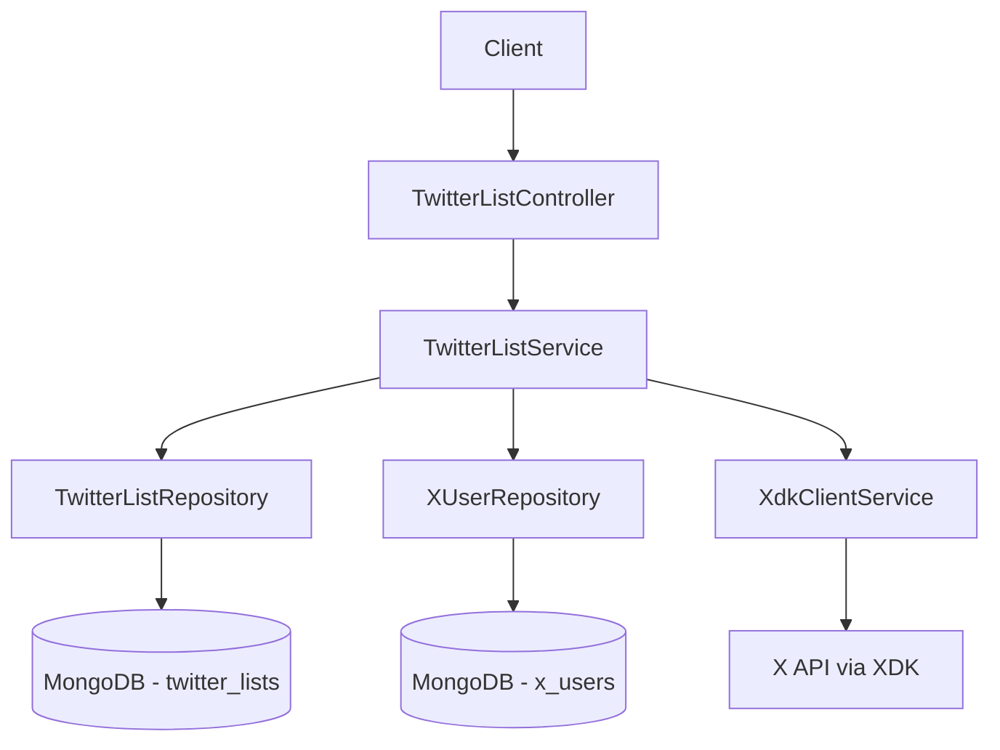

# Twitter Lists Module — Implementation Plan

## Overview

A new NestJS module `twitter-lists` that allows creating, editing, and deleting curated lists of Twitter/X user accounts. Each list has a name, description, and a flag indicating whether it was imported from X. Lists contain members (references to `XUser` documents). The module also exposes endpoints to search for X users, fetch lists owned by the authenticated X account, and import a list from X.

---

## Architecture Diagram



---

## Module Structure

```
src/modules/twitter-lists/
├── twitter-lists.module.ts
├── controllers/
│   └── twitter-lists.controller.ts
├── services/
│   └── twitter-lists.service.ts
├── repositories/
│   └── twitter-list.repository.ts
├── dto/
│   ├── create-list.dto.ts
│   ├── update-list.dto.ts
│   ├── add-member.dto.ts
│   └── search-users.dto.ts
└── schemas/
    └── twitter-list.schema.ts

src/common/database/mongodb/schemas/
└── twitter-list.schema.ts   ← shared schema location (consistent with project)
```

---

## 1. MongoDB Schema — `TwitterList`

**File:** [`src/common/database/mongodb/schemas/twitter-list.schema.ts`](src/common/database/mongodb/schemas/twitter-list.schema.ts)

```typescript
@Schema({ timestamps: true })
export class TwitterList {
  @Prop({ required: true })
  name: string;

  @Prop()
  description: string;

  @Prop({ default: false })
  importedFromX: boolean;

  @Prop({ type: String })          // X list ID (only when importedFromX = true)
  xListId?: string;

  @Prop({ type: [{ type: Types.ObjectId, ref: 'XUser' }], default: [] })
  members: Types.ObjectId[];       // References to XUser documents
}
```

Members are stored as an array of `ObjectId` references to the existing `XUser` collection. This avoids data duplication and allows the same user to appear in multiple lists.

---

## 2. Update `XUserRepository` — Add Search Method

**File:** [`src/modules/twitter-scraper/repositories/x-user.repository.ts`](src/modules/twitter-scraper/repositories/x-user.repository.ts)

Add a `search(query: string)` method that performs a case-insensitive regex search on `username` and `displayName` fields:

```typescript
async search(query: string, limit = 20): Promise<XUser[]> {
  const regex = new RegExp(query, 'i');
  return this.xUserModel
    .find({ $or: [{ username: regex }, { displayName: regex }] })
    .limit(limit)
    .exec();
}

async findByRestId(restId: string): Promise<XUser | null> {
  return this.xUserModel.findOne({ restId }).exec();
}

async findByIds(ids: Types.ObjectId[]): Promise<XUser[]> {
  return this.xUserModel.find({ _id: { $in: ids } }).exec();
}
```

---

## 3. DTOs

### `CreateListDto`
```typescript
{ name: string; description?: string; importedFromX?: boolean; xListId?: string; }
```

### `UpdateListDto`
```typescript
{ name?: string; description?: string; }
```

### `AddMemberDto`
```typescript
{ userId: string; }   // MongoDB ObjectId of XUser
```

### `SearchUsersDto`
```typescript
{ query: string; limit?: number; }
```

---

## 4. `TwitterListRepository`

**File:** [`src/modules/twitter-lists/repositories/twitter-list.repository.ts`](src/modules/twitter-lists/repositories/twitter-list.repository.ts)

Methods:
- `create(data)` → `TwitterList`
- `findById(id)` → `TwitterListDocument | null`
- `findAll(options)` → `TwitterList[]`
- `update(id, data)` → `TwitterList | null`
- `delete(id)` → `boolean`
- `addMember(listId, userId)` → `TwitterList | null`  — uses `$addToSet`
- `removeMember(listId, userId)` → `TwitterList | null` — uses `$pull`
- `count()` → `number`

---

## 5. `TwitterListService`

**File:** [`src/modules/twitter-lists/services/twitter-lists.service.ts`](src/modules/twitter-lists/services/twitter-lists.service.ts)

### Methods

| Method | Description |
|--------|-------------|
| `createList(dto)` | Creates a new list in MongoDB |
| `updateList(id, dto)` | Updates name/description |
| `deleteList(id)` | Deletes list |
| `getLists(options)` | Returns all lists with pagination |
| `getListById(id)` | Returns a single list with populated members |
| `addMember(listId, userId)` | Adds an XUser to the list |
| `removeMember(listId, userId)` | Removes an XUser from the list |
| `searchUsers(query, limit)` | Searches MongoDB first; falls back to XDK `users.search()` if no results |
| `getOwnedXLists(userId)` | Calls `xdkClient.users.getOwnedLists(userId)` |
| `importXList(xListId)` | Fetches members via `xdkClient.lists.getMembers(xListId)`, upserts each as XUser, creates a TwitterList with `importedFromX: true` |

### `searchUsers` Logic

```
1. Search MongoDB XUser collection with regex on username/displayName
2. If results.length >= limit → return MongoDB results
3. Else → call xdkClient.readClient.users.search(query, { maxResults: limit })
4. Upsert each returned user into XUser collection
5. Return combined/deduplicated results
```

### `importXList` Logic

```
1. Call xdkClient.readClient.lists.getMembers(xListId, { userFields: ['id','name','username','profile_image_url','description','public_metrics'], maxResults: 100 })
2. For each member: upsert into XUser collection (using restId as key)
3. Create TwitterList with { name, description, importedFromX: true, xListId, members: [ObjectIds] }
4. Handle pagination if list has > 100 members
```

### `getOwnedXLists` Logic

```
1. Call xdkClient.readClient.users.getOwnedLists(userId, { listFields: ['id','name','description','member_count','owner_id','private'] })
2. Return the raw list data from X API
```

---

## 6. `TwitterListController`

**File:** [`src/modules/twitter-lists/controllers/twitter-lists.controller.ts`](src/modules/twitter-lists/controllers/twitter-lists.controller.ts)

Base route: `api/lists`

| Method | Route | Description |
|--------|-------|-------------|
| `GET` | `/api/lists` | Get all lists (with pagination) |
| `POST` | `/api/lists` | Create a new list |
| `GET` | `/api/lists/:id` | Get list by ID (with populated members) |
| `PATCH` | `/api/lists/:id` | Update list name/description |
| `DELETE` | `/api/lists/:id` | Delete a list |
| `POST` | `/api/lists/:id/members` | Add a member to a list |
| `DELETE` | `/api/lists/:id/members/:userId` | Remove a member from a list |
| `GET` | `/api/lists/users/search?query=&limit=` | Search X users (MongoDB first, then XDK) |
| `GET` | `/api/lists/x/owned?userId=` | Get lists owned by a user on X |
| `POST` | `/api/lists/x/import` | Import a list from X by xListId |

---

## 7. `TwitterListsModule`

**File:** [`src/modules/twitter-lists/twitter-lists.module.ts`](src/modules/twitter-lists/twitter-lists.module.ts)

```typescript
@Module({
  imports: [
    MongooseModule.forFeature([
      { name: TwitterList.name, schema: TwitterListSchema },
      { name: XUser.name, schema: XUserSchema },
    ]),
    TwitterTrackerModule,   // re-exports XdkClientService
  ],
  controllers: [TwitterListController],
  providers: [TwitterListService, TwitterListRepository, XUserRepository],
  exports: [TwitterListService, TwitterListRepository],
})
export class TwitterListsModule {}
```

> **Note:** `XdkClientService` is already exported from `TwitterTrackerModule`, so we import that module to get access to the XDK client without duplicating initialization.

---

## 8. Register in `AppModule`

**File:** [`src/app.module.ts`](src/app.module.ts)

Add `TwitterListsModule` to the `imports` array.

---

## API Examples

### Create a list
```
POST /api/lists
{ "name": "DeFi Influencers", "description": "Top DeFi accounts" }
```

### Search users
```
GET /api/lists/users/search?query=vitalik&limit=10
```
Returns users from MongoDB if found, otherwise queries X API.

### Add member
```
POST /api/lists/:id/members
{ "userId": "<XUser ObjectId>" }
```

### Get owned X lists
```
GET /api/lists/x/owned?userId=<X_USER_ID>
```
Calls `GET /2/users/:id/owned_lists` via XDK `client.users.getOwnedLists(userId)`.

### Import X list
```
POST /api/lists/x/import
{ "xListId": "1234567890", "name": "My Imported List" }
```
Fetches all members via `client.lists.getMembers(xListId)`, upserts them as XUsers, and creates a local list.

---

## XDK API Calls Reference

| Feature | XDK Method |
|---------|-----------|
| Get owned lists | `client.users.getOwnedLists(userId, options)` |
| Get list members | `client.lists.getMembers(listId, options)` |
| Search users | `client.users.search(query, options)` |
| Get user by username | `client.users.getByUsername(username, options)` |

---

## Key Design Decisions

1. **Members stored as ObjectId refs** — avoids duplication; XUser documents are the single source of truth for user data.
2. **XdkClientService reused** — imported via `TwitterTrackerModule` exports; no new client initialization needed.
3. **Search fallback** — MongoDB-first search reduces X API calls and respects rate limits.
4. **Pagination on import** — `getMembers` supports `paginationToken`; the service will loop until all members are fetched.
5. **Schema location** — `TwitterList` schema placed in `src/common/database/mongodb/schemas/` to be consistent with the rest of the project.
6. **`importedFromX` flag** — boolean on the list document; `xListId` stores the original X list ID for reference.
