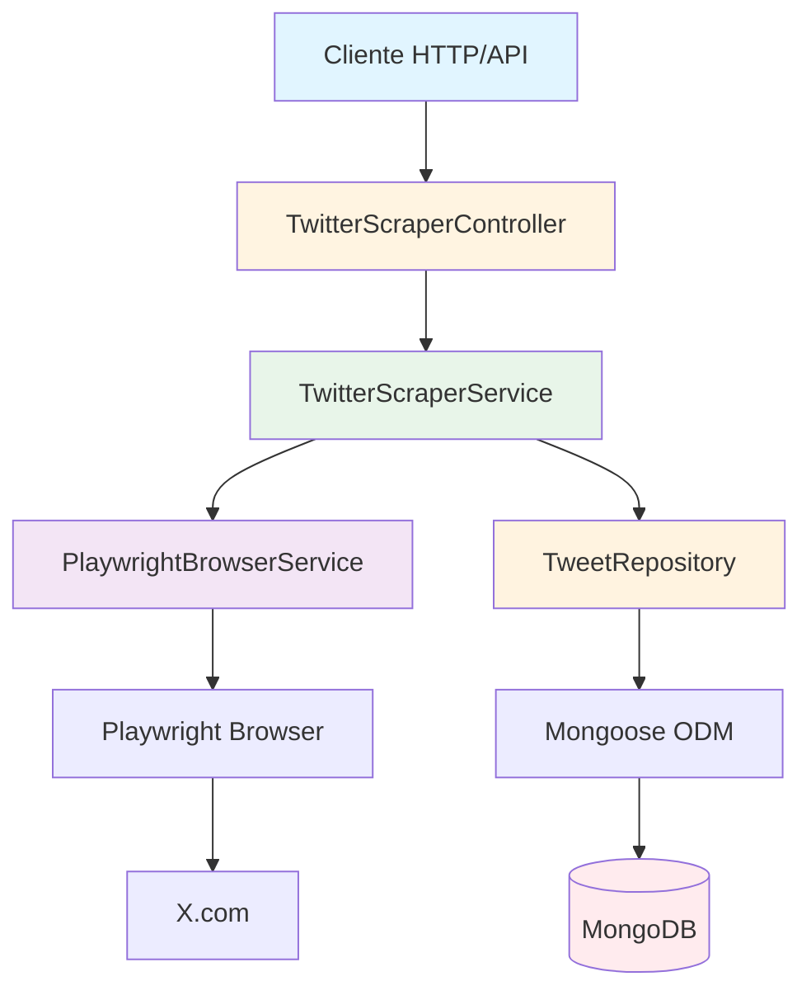
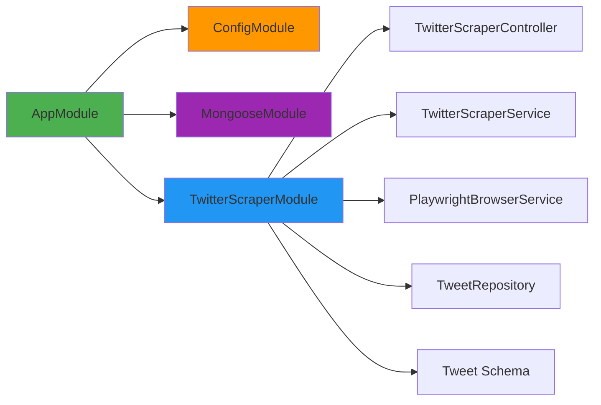
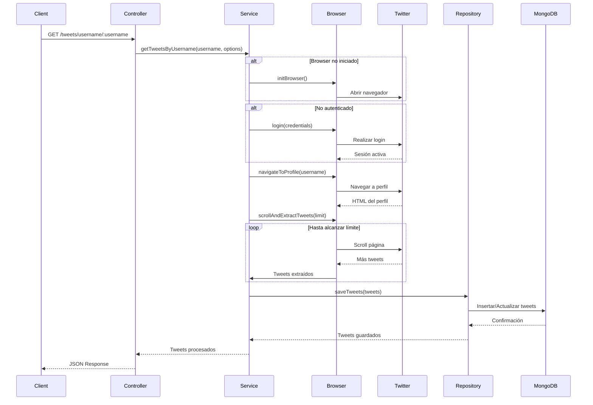
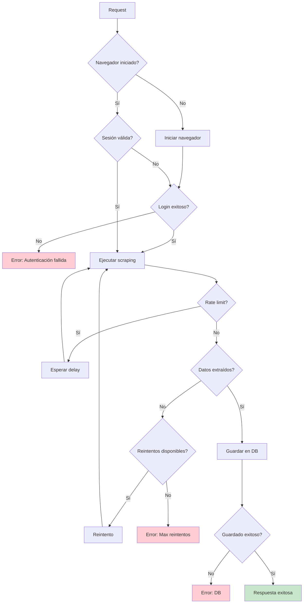

# Arquitectura del Twitter Scraper con Playwright y MongoDB

## Resumen Ejecutivo

Sistema de scraping de Twitter (X.com) construido con NestJS, Playwright y MongoDB. Proporciona tanto una API REST como servicios internos reutilizables para extraer tweets, perfiles de usuario y tendencias, con persistencia de datos y gestión de sesiones de navegador.

## Arquitectura General



## Estructura de Módulos



## Estructura de Directorios

```
src/
├── modules/
│   └── twitter-scraper/
│       ├── twitter-scraper.module.ts
│       ├── controllers/
│       │   └── twitter-scraper.controller.ts
│       ├── services/
│       │   ├── twitter-scraper.service.ts
│       │   └── playwright-browser.service.ts
│       ├── repositories/
│       │   └── tweet.repository.ts
│       ├── schemas/
│       │   └── tweet.schema.ts
│       ├── dto/
│       │   ├── get-tweets-by-username.dto.ts
│       │   ├── search-tweets.dto.ts
│       │   ├── login.dto.ts
│       │   └── tweet-response.dto.ts
│       ├── interfaces/
│       │   ├── tweet.interface.ts
│       │   └── scraper-options.interface.ts
│       └── constants/
│           └── twitter-selectors.constants.ts
├── common/
│   ├── config/
│   │   └── env.validation.ts (actualizar)
│   ├── filters/
│   │   └── global-exception.filter.ts
│   └── interceptors/
│       └── timeout.interceptor.ts (nuevo)
└── app.module.ts (actualizar)
```

## Modelo de Datos - Tweet Schema

```typescript
{
  tweetId: string (unique, indexed)
  text: string
  author: {
    username: string
    displayName: string
    userId: string
    profileImageUrl: string
    verified: boolean
  }
  createdAt: Date
  metrics: {
    likes: number
    retweets: number
    replies: number
    views: number
    bookmarks: number
  }
  media: [{
    type: 'image' | 'video' | 'gif'
    url: string
    thumbnailUrl: string
  }]
  hashtags: string[]
  mentions: string[]
  urls: string[]
  location: string
  tweetType: 'original' | 'retweet' | 'reply' | 'quote'
  inReplyToTweetId: string
  quotedTweetId: string
  retweetedTweetId: string
  language: string
  isThread: boolean
  threadPosition: number
}
```

## Flujo de Scraping



## API REST Endpoints

### Autenticación
- `POST /api/twitter/login` - Iniciar sesión en Twitter
- `POST /api/twitter/logout` - Cerrar sesión
- `GET /api/twitter/session-status` - Verificar estado de sesión

### Scraping de Tweets
- `GET /api/twitter/tweets/username/:username` - Obtener tweets por usuario
  - Query params: `limit`, `includeReplies`, `includeRetweets`
- `POST /api/twitter/tweets/search` - Buscar tweets por término
  - Body: `{ searchTerm, filters, limit }`
- `GET /api/twitter/tweets/:tweetId` - Obtener tweet específico
- `GET /api/twitter/tweets/thread/:tweetId` - Obtener hilo completo

### Perfiles y Datos
- `GET /api/twitter/profile/:username` - Obtener perfil de usuario
- `GET /api/twitter/trends` - Obtener tendencias actuales
- `GET /api/twitter/followers/:username` - Obtener seguidores (limitado)

### Datos Almacenados
- `GET /api/twitter/stored/tweets` - Listar tweets almacenados
  - Query params: `page`, `limit`, `username`, `dateFrom`, `dateTo`
- `GET /api/twitter/stored/stats` - Estadísticas de scraping
- `DELETE /api/twitter/stored/tweets/:tweetId` - Eliminar tweet almacenado

## Servicios Principales

### PlaywrightBrowserService

Responsable de gestionar la sesión persistente del navegador:

```typescript
class PlaywrightBrowserService {
  - browser: Browser
  - context: BrowserContext
  - page: Page
  - isAuthenticated: boolean
  
  + initBrowser(): Promise<void>
  + closeBrowser(): Promise<void>
  + getPage(): Page
  + saveSession(path: string): Promise<void>
  + loadSession(path: string): Promise<void>
  + isSessionActive(): boolean
  + takeScreenshot(name: string): Promise<string>
}
```

**Características:**
- Mantiene una única instancia de navegador
- Guarda y carga cookies/localStorage para persistencia
- Maneja timeouts y reconexiones
- Modo headless configurable
- Captura de screenshots para debugging

### TwitterScraperService

Lógica principal de scraping:

```typescript
class TwitterScraperService {
  + login(username: string, password: string): Promise<boolean>
  + getTweetsByUsername(username: string, options): Promise<Tweet[]>
  + getTweetsFromSearchTerm(searchTerm: string, options): Promise<Tweet[]>
  + getTweetById(tweetId: string): Promise<Tweet>
  + getUserProfile(username: string): Promise<UserProfile>
  + getTrends(location?: string): Promise<Trend[]>
  + getThread(tweetId: string): Promise<Tweet[]>
  - extractTweetData(element: ElementHandle): Promise<Tweet>
  - scrollAndLoad(limit: number): Promise<void>
  - waitForTweets(): Promise<void>
  - handleRateLimiting(): Promise<void>
}
```

**Características:**
- Extracción inteligente de datos del DOM
- Manejo de scroll infinito
- Detección y espera de rate limiting
- Reintentos automáticos en caso de error
- Validación de datos extraídos

### TweetRepository

Capa de acceso a datos:

```typescript
class TweetRepository {
  + create(tweet: CreateTweetDto): Promise<Tweet>
  + findById(tweetId: string): Promise<Tweet>
  + findByUsername(username: string, options): Promise<Tweet[]>
  + findBySearchTerm(term: string, options): Promise<Tweet[]>
  + update(tweetId: string, data: UpdateTweetDto): Promise<Tweet>
  + delete(tweetId: string): Promise<boolean>
  + getStats(): Promise<ScrapingStats>
  + bulkUpsert(tweets: Tweet[]): Promise<number>
}
```

## Selectores de Twitter

Archivo de constantes con selectores CSS/XPath para elementos de Twitter:

```typescript
export const TWITTER_SELECTORS = {
  LOGIN: {
    USERNAME_INPUT: 'input[autocomplete="username"]',
    PASSWORD_INPUT: 'input[type="password"]',
    NEXT_BUTTON: 'button[role="button"]:has-text("Next")',
    LOGIN_BUTTON: 'button[data-testid="LoginForm_Login_Button"]',
  },
  TWEET: {
    ARTICLE: 'article[data-testid="tweet"]',
    TEXT: '[data-testid="tweetText"]',
    AUTHOR_NAME: '[data-testid="User-Name"]',
    TIMESTAMP: 'time',
    LIKE_COUNT: '[data-testid="like"]',
    RETWEET_COUNT: '[data-testid="retweet"]',
    REPLY_COUNT: '[data-testid="reply"]',
    MEDIA: '[data-testid="tweetPhoto"], [data-testid="tweetVideo"]',
  },
  PROFILE: {
    USERNAME: '[data-testid="UserName"]',
    BIO: '[data-testid="UserDescription"]',
    FOLLOWERS: 'a[href$="/followers"] span',
    FOLLOWING: 'a[href$="/following"] span',
  },
};
```

## Variables de Entorno

```env
# Twitter Credentials
TWITTER_USERNAME=your_username
TWITTER_PASSWORD=your_password
TWITTER_EMAIL=your_email@example.com

# MongoDB
MONGODB_URI=mongodb://localhost:27017/twitter-scraper
MONGODB_DB_NAME=twitter-scraper

# Playwright
PLAYWRIGHT_HEADLESS=true
PLAYWRIGHT_TIMEOUT=30000
PLAYWRIGHT_SLOW_MO=100
PLAYWRIGHT_SESSION_PATH=./sessions/twitter-session.json

# Scraping Configuration
SCRAPING_MAX_TWEETS_PER_REQUEST=100
SCRAPING_SCROLL_DELAY=2000
SCRAPING_RETRY_ATTEMPTS=3
SCRAPING_RATE_LIMIT_DELAY=60000
```

## Manejo de Errores



## Estrategias de Scraping

### 1. Scroll Infinito
- Detectar altura actual de la página
- Scroll hacia abajo
- Esperar carga de nuevos tweets
- Extraer tweets visibles
- Repetir hasta alcanzar límite

### 2. Detección de Rate Limiting
- Monitorear respuestas HTTP 429
- Detectar mensajes de "Try again later"
- Implementar backoff exponencial
- Guardar progreso antes de esperar

### 3. Extracción de Datos
- Usar selectores robustos con fallbacks
- Validar datos extraídos
- Manejar tweets eliminados/privados
- Extraer metadata de imágenes/videos

### 4. Persistencia de Sesión
- Guardar cookies después del login
- Cargar cookies al iniciar
- Renovar sesión si expira
- Manejar 2FA si es necesario

## Consideraciones de Seguridad

1. **Credenciales**: Nunca hardcodear, usar variables de entorno
2. **Rate Limiting**: Respetar límites de Twitter para evitar bloqueos
3. **User Agent**: Usar user agents realistas
4. **Proxies**: Considerar rotación de IPs para scraping intensivo
5. **Captchas**: Implementar detección y manejo manual
6. **Datos sensibles**: No almacenar información privada de usuarios

## Optimizaciones

1. **Caché**: Implementar caché de perfiles y tweets recientes
2. **Queue**: Usar Bull/BullMQ para scraping asíncrono
3. **Batch Processing**: Procesar múltiples usuarios en paralelo
4. **Incremental Updates**: Solo scrapear tweets nuevos
5. **Índices MongoDB**: Crear índices en tweetId, username, createdAt

## Testing

### Tests Unitarios
- Servicios de scraping (mocks de Playwright)
- Repositorios (in-memory MongoDB)
- DTOs y validaciones

### Tests E2E
- Endpoints REST completos
- Flujo de login y scraping
- Manejo de errores

### Tests de Integración
- Playwright con Twitter real (ambiente de staging)
- MongoDB con datos de prueba

## Próximos Pasos

1. Implementar autenticación con 2FA
2. Agregar soporte para Twitter Spaces
3. Implementar scraping de DMs (si es necesario)
4. Dashboard de monitoreo de scraping
5. Webhooks para notificaciones de nuevos tweets
6. Exportación de datos (CSV, JSON, Excel)
7. Análisis de sentimientos con NLP
8. Detección de bots y cuentas spam

## Dependencias a Instalar

```bash
yarn add @nestjs/mongoose mongoose
yarn add playwright
yarn add class-validator class-transformer
yarn add @nestjs/throttler  # Para rate limiting en API
```

## Comandos Útiles

```bash
# Desarrollo
yarn start:dev

# Ejecutar scraping manual
yarn scrape:user <username>

# Limpiar base de datos
yarn db:clean

# Exportar datos
yarn export:tweets --format=json --output=./exports

# Tests
yarn test
yarn test:e2e
```
