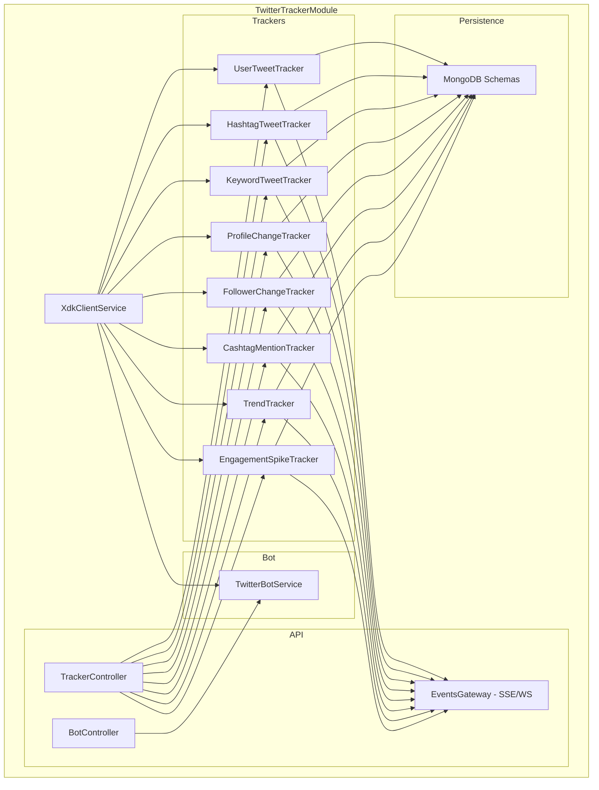
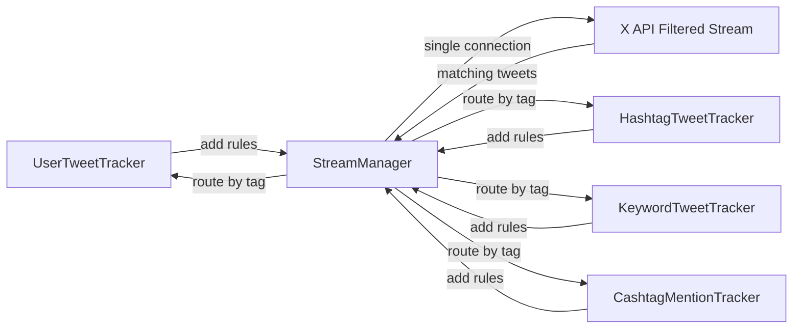

# Twitter Tracker Module Architecture

## Overview

The `twitter-tracker` module provides real-time tracking capabilities using the official **@xdevplatform/xdk** SDK. It includes multiple specialized trackers for monitoring tweets, user profiles, trends, and engagement — plus a bot service for automating Twitter actions.

## XDK API Capabilities Used

| Feature | XDK Method | Auth Required |
|---------|-----------|---------------|
| Filtered Stream (real-time tweets by rules) | `client.stream.posts()` + `client.stream.updateRules()` | Bearer Token |
| Search Recent Posts | `client.posts.searchRecent()` | Bearer Token |
| User Lookup by Username | `client.users.getByUsername()` | Bearer Token |
| User Lookup by ID | `client.users.getById()` | Bearer Token |
| User Lookup by IDs (batch) | `client.users.getByIds()` | Bearer Token |
| Activity Subscriptions (profile changes) | `client.activity.createSubscription()` | Bearer Token |
| Activity Stream | `client.activity.stream()` | Bearer Token |
| Create Post | `client.posts.create()` | OAuth1 / OAuth2 User |
| Repost | `client.users.repostPost()` | OAuth1 / OAuth2 User |
| Like Post | `client.users.likePost()` | OAuth1 / OAuth2 User |
| Follow User | `client.users.followUser()` | OAuth1 / OAuth2 User |
| Get Trends | `client.trends.getByWoeid()` | Bearer Token |
| Get Personalized Trends | `client.trends.getPersonalized()` | OAuth2 User |
| Get User Followers | `client.users.getFollowers()` | Bearer Token |
| Get User Posts | `client.users.getPosts()` | Bearer Token |

## Architecture Diagram



## File Structure

```
src/modules/twitter-tracker/
├── twitter-tracker.module.ts
├── config/
│   └── xdk-client.config.ts              # XDK client configuration constants
├── services/
│   ├── xdk-client.service.ts             # Shared XDK Client wrapper
│   ├── stream-manager.service.ts         # Manages filtered stream lifecycle and rules
│   ├── trackers/
│   │   ├── user-tweet-tracker.service.ts
│   │   ├── hashtag-tweet-tracker.service.ts
│   │   ├── keyword-tweet-tracker.service.ts
│   │   ├── profile-change-tracker.service.ts
│   │   ├── follower-change-tracker.service.ts
│   │   ├── cashtag-mention-tracker.service.ts
│   │   ├── trend-tracker.service.ts
│   │   └── engagement-spike-tracker.service.ts
│   └── bot/
│       └── twitter-bot.service.ts
├── schemas/
│   ├── tracker-config.schema.ts          # Tracker configuration stored in DB
│   ├── tracked-tweet.schema.ts           # Tweets captured by trackers
│   ├── user-profile-snapshot.schema.ts   # Profile snapshots for change detection
│   ├── profile-change-log.schema.ts      # Log of detected profile changes
│   ├── follower-snapshot.schema.ts       # Follower count snapshots
│   ├── trend-snapshot.schema.ts          # Trend snapshots over time
│   └── engagement-snapshot.schema.ts     # Engagement metrics snapshots
├── repositories/
│   ├── tracker-config.repository.ts
│   ├── tracked-tweet.repository.ts
│   ├── user-profile-snapshot.repository.ts
│   ├── profile-change-log.repository.ts
│   ├── follower-snapshot.repository.ts
│   ├── trend-snapshot.repository.ts
│   └── engagement-snapshot.repository.ts
├── controllers/
│   ├── tracker.controller.ts             # CRUD for tracker configs + start/stop
│   └── bot.controller.ts                 # Bot action endpoints
├── gateways/
│   └── tracker-events.gateway.ts         # SSE or WebSocket for real-time events
├── dto/
│   ├── create-tracker.dto.ts
│   ├── update-tracker.dto.ts
│   ├── bot-post.dto.ts
│   ├── bot-repost.dto.ts
│   ├── bot-quote.dto.ts
│   └── bot-like.dto.ts
├── interfaces/
│   ├── tracker-event.interface.ts        # Common event shape emitted by trackers
│   └── tracker-type.enum.ts             # Enum of tracker types
└── constants/
    └── tracker.constants.ts              # Polling intervals, limits, etc.
```

## Trackers Detail

### 1. UserTweetTracker

**Purpose:** Monitor tweets in real-time from a specific list of users.

**XDK Methods:**
- `client.stream.updateRules()` — Add rules like `from:user1 OR from:user2`
- `client.stream.posts()` — Connect to filtered stream
- Fallback: `client.users.getPosts()` — Polling user timelines

**How it works:**
1. On start, resolve usernames to user IDs via `client.users.getByUsernames()`
2. Create filtered stream rules: `from:<userId1> OR from:<userId2>`
3. Connect to `client.stream.posts()` and listen for matching tweets
4. Save each tweet to `TrackedTweet` collection in MongoDB
5. Emit event via SSE/WebSocket gateway

### 2. HashtagTweetTracker

**Purpose:** Monitor tweets containing specific hashtags or topics in real-time.

**XDK Methods:**
- `client.stream.updateRules()` — Add rules like `#bitcoin OR #ethereum`
- `client.stream.posts()` — Connect to filtered stream

**How it works:**
1. Create filtered stream rules: `#hashtag1 OR #hashtag2`
2. Connect to stream and process matching tweets
3. Save and emit events

### 3. KeywordTweetTracker

**Purpose:** Monitor tweets containing specific keywords in real-time.

**XDK Methods:**
- `client.stream.updateRules()` — Add rules like `keyword1 OR keyword2`
- `client.stream.posts()` — Connect to filtered stream

**How it works:**
1. Create filtered stream rules with keyword operators
2. Connect to stream and process matching tweets
3. Save and emit events

### 4. ProfileChangeTracker

**Purpose:** Detect when tracked users change their profile (name, bio, avatar, banner, etc.).

**XDK Methods - Primary (XAA Activity API):**
- `client.activity.createSubscription()` with event types:
  - `profile.update.bio`
  - `profile.update.profile_picture`
  - `profile.update.banner_picture`
  - `profile.update.screenname`
  - `profile.update.url`
  - `profile.update.verified_badge`
- `client.activity.stream()` — Listen for profile change events

**XDK Methods - Fallback (Polling):**
- `client.users.getByIds()` — Periodically fetch user profiles
- Compare with stored `UserProfileSnapshot` to detect changes

**How it works:**
1. For each tracked user, create an activity subscription for profile update events
2. Connect to `client.activity.stream()` to receive real-time profile change notifications
3. On each change event, save a new `UserProfileSnapshot` and log the change in `ProfileChangeLog`
4. Fallback: Poll `client.users.getByIds()` every N minutes, diff against last snapshot
5. Emit change events via gateway

**MongoDB Schema - UserProfileSnapshot:**
```
{
  userId: string,
  username: string,
  displayName: string,
  bio: string,
  profileImageUrl: string,
  profileBannerUrl: string,
  location: string,
  url: string,
  verified: boolean,
  verifiedType: string,
  followersCount: number,
  followingCount: number,
  tweetCount: number,
  snapshotAt: Date
}
```

**MongoDB Schema - ProfileChangeLog:**
```
{
  userId: string,
  username: string,
  field: string,          // e.g. 'bio', 'profileImageUrl', 'displayName'
  oldValue: string,
  newValue: string,
  detectedAt: Date,
  source: 'activity_stream' | 'polling'
}
```

### 5. FollowerChangeTracker

**Purpose:** Monitor follower count changes and detect new followers/unfollowers for tracked users.

**XDK Methods:**
- `client.activity.createSubscription()` with events: `follow.follow`, `follow.unfollow`
- `client.activity.stream()` — Listen for follow/unfollow events
- Fallback: `client.users.getById()` — Poll follower counts
- `client.users.getFollowers()` — Get follower list for diff

**Why useful for memecoin traders:**
- Sudden follower spikes on crypto influencer accounts can signal upcoming pumps
- Whale accounts following new projects is an early signal

### 6. CashtagMentionTracker

**Purpose:** Track $CASHTAG mentions (e.g., $BTC, $ETH, $PEPE, $DOGE) in real-time for memecoin traders.

**XDK Methods:**
- `client.stream.updateRules()` — Rules like `$BTC OR $ETH OR $PEPE`
- `client.stream.posts()` — Filtered stream
- `client.posts.getCountsRecent()` — Get mention volume over time

**Why useful for memecoin traders:**
- Detect sudden spikes in cashtag mentions (potential pump signals)
- Track mention velocity (mentions per minute)
- Correlate with price action
- Identify which influencers are talking about specific tokens

**Additional features:**
- Mention velocity calculation (mentions/minute)
- Sentiment analysis hooks (can be extended)
- Volume alerts when mentions exceed threshold

### 7. TrendTracker

**Purpose:** Monitor trending topics and detect emerging trends relevant to crypto/memecoins.

**XDK Methods:**
- `client.trends.getByWoeid()` — Get trends by location
- `client.trends.getPersonalized()` — Get personalized trends

**How it works:**
1. Poll trends at regular intervals (e.g., every 5 minutes)
2. Store `TrendSnapshot` in MongoDB
3. Compare consecutive snapshots to detect:
   - New trends appearing
   - Trends gaining momentum (rising tweet count)
   - Trends disappearing
4. Filter for crypto-related trends using keyword matching
5. Emit alerts for relevant emerging trends

### 8. EngagementSpikeTracker

**Purpose:** Detect sudden spikes in engagement (likes, retweets, replies, views) on tracked posts or from tracked users.

**XDK Methods:**
- `client.posts.getById()` — Get post metrics
- `client.posts.getByIds()` — Batch get post metrics
- `client.users.getPosts()` — Get recent posts from tracked users

**How it works:**
1. Periodically poll metrics for tracked posts
2. Store `EngagementSnapshot` in MongoDB
3. Calculate rate of change (delta per time unit)
4. Trigger alerts when engagement rate exceeds configurable thresholds
5. Useful for detecting viral posts early

**Why useful for memecoin traders:**
- Viral tweets from influencers about tokens often precede price movements
- Early detection of engagement spikes = early entry opportunity

## Bot Service Detail

### TwitterBotService

**Purpose:** Automate Twitter actions for the authenticated user.

**XDK Methods:**
- `client.posts.create()` — Create new posts
- `client.posts.create({ quoteTweetId })` — Quote tweet
- `client.posts.create({ reply: { inReplyToTweetId } })` — Reply to tweet
- `client.users.repostPost()` — Retweet
- `client.users.likePost()` — Like a post
- `client.users.followUser()` — Follow a user
- `client.users.unfollowUser()` — Unfollow a user
- `client.media.initializeUpload()` + `client.media.appendUpload()` + `client.media.finalizeUpload()` — Upload media

**Features:**
- **Post creation** with text, media, polls
- **Quote tweeting** other users posts
- **Replying** to specific tweets
- **Retweeting** posts
- **Liking** posts
- **Auto-engagement** rules (e.g., auto-like posts from tracked users matching certain keywords)
- **Scheduled posting** via cron-like scheduling
- **Rate limit awareness** to avoid API bans

**API Endpoints:**
```
POST /api/bot/post          — Create a new post
POST /api/bot/quote         — Quote a tweet
POST /api/bot/reply         — Reply to a tweet
POST /api/bot/repost        — Retweet a post
POST /api/bot/like          — Like a post
POST /api/bot/follow        — Follow a user
DELETE /api/bot/follow/:id  — Unfollow a user
```

## StreamManager Service

Since the X API Filtered Stream is a **single connection per app** that handles ALL rules simultaneously, we need a centralized `StreamManagerService` that:

1. Maintains a single `EventDrivenStream` connection
2. Aggregates rules from all trackers (UserTweet, Hashtag, Keyword, Cashtag)
3. Tags rules so incoming tweets can be routed to the correct tracker
4. Handles reconnection and error recovery
5. Distributes incoming events to the appropriate tracker services



## Environment Variables

New variables needed in `.env`:

```bash
# X API Official (XDK) Credentials
X_API_BEARER_TOKEN=your-bearer-token
X_API_KEY=your-api-key
X_API_SECRET=your-api-secret
X_API_ACCESS_TOKEN=your-access-token
X_API_ACCESS_TOKEN_SECRET=your-access-token-secret

# Tracker Configuration
TRACKER_PROFILE_POLL_INTERVAL=300000      # 5 minutes in ms
TRACKER_FOLLOWER_POLL_INTERVAL=600000     # 10 minutes in ms
TRACKER_TREND_POLL_INTERVAL=300000        # 5 minutes in ms
TRACKER_ENGAGEMENT_POLL_INTERVAL=60000    # 1 minute in ms
TRACKER_TREND_WOEID=1                     # 1 = Worldwide
```

## API Endpoints

### Tracker Management

```
GET    /api/trackers                    — List all tracker configs
POST   /api/trackers                    — Create a new tracker
GET    /api/trackers/:id                — Get tracker by ID
PATCH  /api/trackers/:id                — Update tracker config
DELETE /api/trackers/:id                — Delete tracker
POST   /api/trackers/:id/start          — Start a tracker
POST   /api/trackers/:id/stop           — Stop a tracker
GET    /api/trackers/:id/events         — Get historical events for a tracker
```

### Real-time Events

```
GET    /api/trackers/events/stream      — SSE endpoint for all tracker events
GET    /api/trackers/:id/events/stream  — SSE endpoint for specific tracker events
```

### Profile Change History

```
GET    /api/trackers/profiles/:userId/history    — Get profile change history
GET    /api/trackers/profiles/:userId/snapshots  — Get profile snapshots
```

## TrackerConfig Schema

```typescript
{
  name: string,                    // Human-readable name
  type: TrackerType,               // enum: user_tweet, hashtag, keyword, profile_change, etc.
  status: 'active' | 'paused' | 'error',
  config: {
    // For user_tweet tracker:
    usernames?: string[],
    userIds?: string[],
    
    // For hashtag tracker:
    hashtags?: string[],
    
    // For keyword tracker:
    keywords?: string[],
    
    // For cashtag tracker:
    cashtags?: string[],
    
    // For profile_change tracker:
    trackedUserIds?: string[],
    trackedFields?: string[],      // which fields to monitor
    
    // For follower_change tracker:
    trackedUserIds?: string[],
    
    // For trend tracker:
    woeid?: number,
    filterKeywords?: string[],     // only alert on trends matching these
    
    // For engagement_spike tracker:
    trackedPostIds?: string[],
    trackedUserIds?: string[],
    thresholds?: {
      likesPerMinute?: number,
      retweetsPerMinute?: number,
      repliesPerMinute?: number,
    }
  },
  streamRuleIds?: string[],        // X API rule IDs for this tracker
  lastRunAt?: Date,
  errorMessage?: string,
  createdAt: Date,
  updatedAt: Date
}
```

## Implementation Priority

1. **Phase 1 - Foundation:**
   - XdkClientService
   - StreamManagerService
   - TrackerConfig schema + repository
   - TrackerController (CRUD)

2. **Phase 2 - Core Trackers:**
   - UserTweetTracker
   - KeywordTweetTracker
   - HashtagTweetTracker
   - CashtagMentionTracker

3. **Phase 3 - Profile & Follower Monitoring:**
   - ProfileChangeTracker
   - FollowerChangeTracker
   - UserProfileSnapshot + ProfileChangeLog schemas

4. **Phase 4 - Analytics Trackers:**
   - TrendTracker
   - EngagementSpikeTracker

5. **Phase 5 - Bot Service:**
   - TwitterBotService
   - BotController

6. **Phase 6 - Real-time Delivery:**
   - EventsGateway (SSE/WebSocket)
   - Event routing and filtering

## Key Considerations

### Rate Limits
- Filtered Stream: 1 connection per app, up to 25/1000 rules depending on tier
- Search Recent: 450 requests/15 min (app auth), 180/15 min (user auth)
- User Lookup: 300 requests/15 min (app auth)
- Post Creation: 200 posts/15 min (user auth)
- Trends: 75 requests/15 min

### Authentication Strategy
- **Read operations** (trackers): Use Bearer Token
- **Write operations** (bot): Use OAuth1 (apiKey + apiSecret + accessToken + accessTokenSecret)
- The XdkClientService should support both auth methods

### Error Handling
- Stream disconnection: Auto-reconnect with exponential backoff (built into XDK EventDrivenStream)
- Rate limit exceeded: Queue and retry with backoff
- API errors: Log, update tracker status to 'error', notify via gateway

### Scalability
- Single filtered stream connection shared across all stream-based trackers
- Polling-based trackers use configurable intervals
- MongoDB TTL indexes on snapshots to prevent unbounded growth
